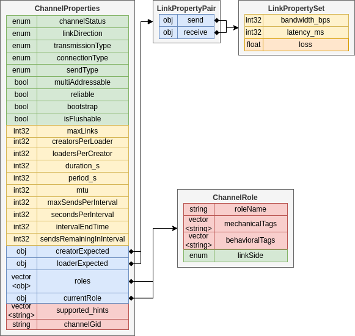
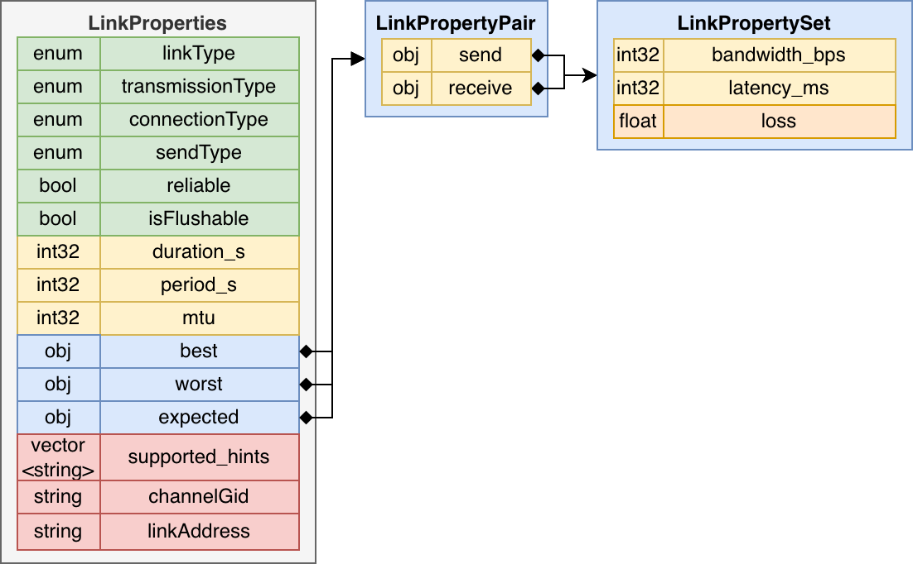

# Table of Contents
- [Table of Contents](#table-of-contents)
- [Overview](#overview)
- [ChannelProperties](#channelproperties)
  - [Most ChannelProperties Fields are Static](#most-channelproperties-fields-are-static)
  - [Fields](#fields)
- [LinkProperties](#linkproperties)
  - [Properties Definitions](#properties-definitions)
- [ChannelProperties In-Depth](#channelproperties-in-depth)
  - [channelStatus (ENUM):](#channelstatus-enum)
    - [CHANNEL\_UNDEF](#channel_undef)
    - [CHANNEL\_AVAILABLE](#channel_available)
    - [CHANNEL\_UNAVAILABLE](#channel_unavailable)
    - [CHANNEL\_ENABLED](#channel_enabled)
    - [CHANNEL\_DISABLED](#channel_disabled)
    - [CHANNEL\_STARTING](#channel_starting)
    - [CHANNEL\_FAILED](#channel_failed)
    - [CHANNEL\_UNSUPPORTED](#channel_unsupported)
  - [linkDirection (ENUM):](#linkdirection-enum)
  - [transmissionType (ENUM):](#transmissiontype-enum)
  - [connectionType (ENUM):](#connectiontype-enum)
    - [CT\_DIRECT](#ct_direct)
    - [CT\_INDIRECT](#ct_indirect)
    - [CT\_MIXED](#ct_mixed)
    - [CT\_LOCAL](#ct_local)
  - [linkType (ENUM):](#linktype-enum)
    - [LT\_SEND:](#lt_send)
    - [LT\_RECV:](#lt_recv)
    - [LT\_BIDI:](#lt_bidi)
  - [sendType (ENUM)](#sendtype-enum)
  - [multiAddressable (bool):](#multiaddressable-bool)
  - [reliable (bool):](#reliable-bool)
  - [bootstrap (bool):](#bootstrap-bool)
  - [isFlushable (bool):](#isflushable-bool)
  - [maxLinks (int32):](#maxlinks-int32)
  - [creatorsPerLoader (int32):](#creatorsperloader-int32)
  - [loadersPerCreator (int32):](#loaderspercreator-int32)
  - [duration\_s (int32):](#duration_s-int32)
  - [period\_s (int32):](#period_s-int32)
  - [Supported Hints (vector):](#supported-hints-vector)
  - [mtu (int32):](#mtu-int32)
  - [creatorExpected (LinkPropertyPair):](#creatorexpected-linkpropertypair)
  - [loaderExpected (LinkPropertyPair):](#loaderexpected-linkpropertypair)
  - [best (LinkPropertySet):](#best-linkpropertyset)
  - [worst (LinkPropertySet):](#worst-linkpropertyset)
  - [expected (LinkPropertySet):](#expected-linkpropertyset)
  - [LinkPropertyPair:](#linkpropertypair)
  - [LinkPropertySet:](#linkpropertyset)
    - [bandwidth\_bps (int32):](#bandwidth_bps-int32)
    - [latency\_ms (int32):](#latency_ms-int32)
    - [loss (float):](#loss-float)
  - [roles (vector)](#roles-vector)
  - [currentRole (ChannelRole)](#currentrole-channelrole)
  - [ChannelRole:](#channelrole)
    - [roleName (string):](#rolename-string)
    - [mechanicalTags (vector):](#mechanicaltags-vector)
    - [behavioralTags (vector):](#behavioraltags-vector)
  - [maxSendsPerInterval (int32)](#maxsendsperinterval-int32)
  - [secondsPerInterval (int32)](#secondsperinterval-int32)
  - [intervalEndTime (uint64)](#intervalendtime-uint64)
  - [sendsRemainingInInterval (int32)](#sendsremainingininterval-int32)
  - [channelGid (string):](#channelgid-string)
  - [linkAddress (string):](#linkaddress-string)
- [Anonymity](#anonymity)
  - [Definitions:](#definitions)
  - [Table](#table)

# Overview
This page lays out details on the contents and use of the `LinkProperties` and `ChannelProperties` objects (and, by extension, `channel_properties.json`).

# ChannelProperties
The SDK reads `ChannelProperties` from each plugin's `channel_properties.json` file before the plugin is even loaded. 

## Most ChannelProperties Fields are Static
`ChannelProperties` provide almost entirely static information about a channel. The SDK will enforce the static nature of most `ChannelProperties` fields.

Only `channelStatus`, `currentRole`, and the `maxSendsPerInterval` properties should ever change; all other `ChannelProperties` fields should be static. Furthermore, comms plugins do not need to set the `ChannelProperties`.`channelStatus` or `ChannelProperties`.`currentRole` fields, these will be overwritten by the SDK based on the `ChannelStatus` argument passed in the `onChannelStatusChanged(...)` API call and the `roleName` field passed in the `activateChannel(...)` API call (from the network manager).

## Fields
This diagram visualizes the `ChannelProperties` object and its attributes.

More in-depth descriptions of these fields are provided in the table and text below.

# LinkProperties
This diagram visualizes the `LinkProperties` object and its attributes.

More in-depth descriptions of these fields are provided in the table and text below.

## Properties Definitions

| Property Name            | Parent Structure                  | Data Type                                                                                    | Example                                           | Default Value                        | Summary                                                                                                                                                                                                                                                                                                                                            |     |     |
| ------------------------ | --------------------------------- | -------------------------------------------------------------------------------------------- | ------------------------------------------------- | ------------------------------------ | -------------------------------------------------------------------------------------------------------------------------------------------------------------------------------------------------------------------------------------------------------------------------------------------------------------------------------------------------- | --- | --- |
| `channelStatus`            | `ChannelProperties`                 | `ChannelStatus` ENUM(`CHANNEL_AVAILABLE`, `CHANNEL_UNAVAILABLE`, `CHANNEL_ENABLED`, `CHANNEL_DISABLED`, `CHANNEL_STARTING`, `CHANNEL_FAILED`, `CHANNEL_UNSUPPORTED`) | `CHANNEL_AVAILABLE`                                 | `CHANNEL_UNDEF` (invalid!)             | Represents status of the channel, only `CHANNEL_AVAILABLE` conveys it is ready to use for creating/loading links.                                                                                                                                                                                                      |     |     |
| `linkDirection`            | `ChannelProperties`                 | `LinkDirection` ENUM(`LD_CREATOR_TO_LOADER`, `LD_LOADER_TO_CREATOR`, `LD_BIDI`)                      | `LD_CREATOR_TO_LOADER`                              | `LD_UNDEF` (invalid!)                  | The direction a created vs. loaded link will have, more detail below                                                                                                                                                                                                                                                      |     |     |
| `transmissionType`         | `ChannelProperties`, `LinkProperties` | `TransmissionType` ENUM(`TT_UNICAST`, `TT_MULTICAST`)                                                    | `TT_UNICAST`                                        | `TT_UNDEF` (invalid!)                  | Knowing whether sending on this link can reach multiple recipients simultaneously.                                                                                                                                                                                                                                                                 |     |     |
| `connectionType`           | `ChannelProperties`, `LinkProperties` | `ConnectionType` ENUM( `CT_DIRECT`, `CT_INDIRECT`, `CT_MIXED`, `CT_LOCAL`)                             | `CT_DIRECT`                                         | `CT_UNDEF` (invalid!)                  | Whether a link is a direct network connection (e.g. a socket) between nodes, goes through a 3rd-party service such as a public whiteboard, does both, or is restricted to being physically co-located                                                                                                                                               |     |     |
| `linkType`                 | `LinkProperties`                    | `LinkType` ENUM(`LT_SEND`, `LT_RECV`, `LT_BIDI`)                                                              | `LT_SEND`                                           | `LT_UNDEF` (invalid!)                  | Knowing whether this link can communicate bidirectionally or only send or receive.                                                                                                                                                                                                                                                                 |     |     |
| `sendType`                 | `ChannelProperties`, `LinkProperties` | `SendType` ENUM(`ST_STORED_ASYNC`, `ST_EPHEM_SYNC`)                                                | `ST_STORED_ASYNC`                                   | `ST_UNDEF` (invalid!)                  | The sending semantics - whether the sender knows if the receiver is listening and whether the receiver can receive asynchronously.                                                                                                                                                                                                                 |     |     |
| `multiAddressable`         | `ChannelProperties`                 | bool                                                                                         | true                                              | false                                | Whether this channel supports loading multiple `LinkAddresses` to construct a single link.                                                                                                                                                                                                                                                           |     |     |
| `reliable`                 | `ChannelProperties`, `LinkProperties` | bool                                                                                         | true                                              | false                                | Selecting a reliable link allows the sending network manager to know they will be notified that their bits arrived at the receiver comms plugin or that a failure may have occurred.                                                                                                                                                                                    |     |     |
| `bootstrap`                | `ChannelProperties`                 | bool                                                                                         | true                                              | false                                | Whether this channel can function as a bootstrap link - supporting a non-RACE node with a shared secret being able to acquire a bundle of bootstrap data from it.                                                                                                                                                                                  |     |     |
| `isFlushable`              | `ChannelProperties`, `LinkProperties` | bool                                                                                         | true                                              | false                                | Whether this channel supports the `flushChannel(...)` API                                                                                                                                                                                                                                                                                            |     |     |
| `maxLinks`                 | `ChannelProperties`                 | int32                                                                                        | 10                                                | -1                                   | The maximum number of links that can exist at one time for this channel.                                                                                                                                                                                                                                                                           |     |     |
| `creatorsPerLoader`        | `ChannelProperties`                 | int32                                                                                        | 3                                                 | -1                                   | The maximum number of different creators this channel can load links to.                                                                                                                                                                                                                                                                           |     |     |
| `loadersPerCreator`        | `ChannelProperties`                 | int32                                                                                        | 5                                                 | -1                                   | The maximum number of loaders that can load links to this creator (could be the same or different `LinkAddresses`).                                                                                                                                                                                                                                  |     |     |
| `duration_s`               | `ChannelProperties`, `LinkProperties` | int32                                                                                        | 600                                               | -1                                   | Selecting a link for a sequence of connections expected to take place over a certain span of time.                                                                                                                                                                                                                                                 |     |     |
| `period_s`                 | `ChannelProperties`, `LinkProperties` | int32                                                                                        | 1200                                              | -1                                   | Knowing that selecting this link will prevent its re-use for a certain span of time.                                                                                                                                                                                                                                                               |     |     |
| `supported_hints`          | `ChannelProperties`, `LinkProperties` | vector<string>                                                                               | ["batch", "polling_interval"]                     | []                                   | Determining if a certain hint will apply to a link.                                                                                                                                                                                                                                                                                                |     |     |
| `mtu`                      | `ChannelProperties`, `LinkProperties` | int32                                                                                        | 1518                                              | -1                                   | Knowing whether packages over a certain size will cause fragmentation at the comms plugin layer (potentially creating performance or reliability concerns).                                                                                                                                                                                                 |     |     |
| `creatorExpected`          | `ChannelProperties`                 | `LinkPropertyPair`                                                                             |                                                   |                                      | Expected performance for a creator-role side of this channel.                                                                                                                                                                                                                                                                                      |     |     |
| `loaderExpected`           | `ChannelProperties`                 | `LinkPropertyPair`                                                                             |                                                   |                                      | Expected performance for a loader-role side of this channel.                                                                                                                                                                                                                                                                                       |     |     |
| `best`                     | `LinkProperties`                    | `LinkPropertyPair`                                                                             |                                                   |                                      | Best-case performance for this link.                                                                                                                                                                                                                                                                                                               |     |     |
| `worst`                    | `LinkProperties`                    | `LinkPropertyPair`                                                                             |                                                   |                                      | Worst-case performance for this link.                                                                                                                                                                                                                                                                                                              |     |     |
| `expected`                 | `LinkProperties`                    | `LinkPropertyPair`                                                                             |                                                   |                                      | Expected-case performance for this link, based on local and recent measurement.                                                                                                                                                                                                                                                                    |     |     |
| `LinkPropertySet`          | `LinkPropertyPair`                  | send: `LinkPropertySet` receive: `LinkPropertySet`                                               | -                                                 | -                                    | Bandwidth, latency, loss values as defined below.                                                                                                                                                                                                                                                                                                  |     |     |
| `bandwidth_bps`            | `LinkPropertySet`                   | int32                                                                                        | 10,000,000                                        | -1                                   | Bandwidth in bits-per-second of goodput                                                                                                                                                                                                                                                                                                            |     |     |
| `latency_ms`               | `LinkPropertySet`                   | int32                                                                                        | 100                                               | -1                                   | Unidirectional latency in milliseconds                                                                                                                                                                                                                                                                                                             |     |     |
| `loss`                     | `LinkPropertySet`                   | float                                                                                        | 0.34                                              | -1.0                                 | Loss percentage as decimal value                                                                                                                                                                                                                                                                                                                   |     |     |
| `roles`                    | `ChannelProperties`                 | vector<ChannelRole>                                                                          | [{"default", [], [], "`LS_BOTH`"}]                  | [{"", [], [], "`LS_UNDEF`"}] (invalid!) | List of roles that can be activated (only one role may be active at a time)                                                                                                                                                                                                                                                                        |     |     |
| `roleName`                 | `ChannelRole`                       | string                                                                                       | "default"                                         | "" (invalid!)                        | The name of a role, must be unique among all roles for this channel                                                                                                                                                                                                                                                                                |     |     |
| `mechanicalTags`           | `ChannelRole`                       | vector<string>                                                                               | ["reddit"]                                        | []                                   | List of mechanical tags this role "claims" when active - no other channel/role with these tags may run simultaneously, and if any others are running then this role will fail to be activated.                                                                                                                                                     |     |     |
| `behavioralTags`           | `ChannelRole`                       | vector<string>                                                                               | ["user", "gaming"]                                | []                                   | List of behavioral tags this role requires to be supported by the environment; if one or more behavioral tags is not supported by the environment according to the race configuration, then this role will fail to be activated.                                                                                                                   |     |     |
| `linkSide`                 | `ChannelRole`                       | ENUM{`LS_UNDEF`, `LS_CREATOR`, `LS_LOADER`, `LS_BOTH`}                                               | `LS_LOADER`                                         | `LS_UNDEF` (invalid!)                  | The sides of a link this role can participate as.                                                                                                                                                                                                                                                                                                  |     |     |
| `channelGid`               | `ChannelProperties`, `LinkProperties` | string                                                                                       | "twoSixIndirectCpp"                               | "" (invalid!)                        | `ChannelGid` of this channel or link                                                                                                                                                                                                                                                                                                                 |     |     |
| `currentRole`              | `ChannelProperties`                 | `ChannelRole`                                                                                  | {"default", [], [], "`LS_BOTH`"}                    | {"", [], [], "`LS_UNDEF`"}              | `ChannelRole` object of the role currently active for this channel                                                                                                                                                                                                                                                                                   |     |     |
| `linkAddress`              | `LinkProperties`                    | string                                                                                       | "{\"host\":\"127.0.0.1\", \"port\":5543}"         | ""                                   | `LinkAddress` of this link                                                                                                                                                                                                                                                                                                                           |     |     |
| `maxSendsPerInterval`      | `ChannelProperties`                 | int32                                                                                        | 200                                               | -1                                   | The maximum number of sends that can occur on the channel within any given interval. A send does not correspond to a sent encrypted package if batching or fragmentation occur within the comms channel. If a channel does not have a send limit, this value should be -1 . This value may be updated dynamically during runtime by the comms channel. |     |     |
| `secondsPerInterval`       | `ChannelProperties`                 | int32                                                                                        | 60                                                | -1                                   | The number of seconds in each interval. If a channel does not have a send limit, this value should be -1 . This value may be updated dynamically during runtime by the comms channel.                                                                                                                                                                |     |     |
| `intervalEndTime`          | `ChannelProperties`                 | uint64                                                                                       | 1663167489123 (e.g., 2022-09-14 10:58:09.123 EDT) | 0                                    | The unix epoch timestamp (milliseconds since 1970) for the end of the current interval. If a channel does not have a send limit, this value should be 0 . It is expected that this will have a static value of 0 in `channel_properties.json` and then dynamically updated during runtime by the comms channel.                                        |     |     |
| `sendsRemainingInInterval` | `ChannelProperties`                 | int32                                                                                        | 150                                               | -1                                   | The number of sends that can still be performed in the current interval. If a channel does not have a send limit, this value should be -1 . It is expected that this will have a static value of -1 in `channel_properties.json` and then dynamically updated during runtime by the comms channel.                                                     |     |     |

# ChannelProperties In-Depth

Default Values:
If the comms plugin does not set the values of a field, or wishes to indicate the field does not apply to the link, the following default values shall be used:

| Type           | Default |
| -------------- | ------- |
| bool           | false   |
| int32          | -1      |
| uin64          | 0       |
| float          | -1      |
| vector<string> | [ ]     |
| enum           | UNDEF   |

## channelStatus (ENUM):
The `channelStatus` field specifies the current status of the channel. `channelStatus` is the only channel property that is not listed in the the `channel_properties.json`, it is determined at runtime only.

### CHANNEL_UNDEF
``CHANNEL_UNDEF`` indicates the channel status is unknown/undefined. This status should not be encountered at runtime.

### CHANNEL_AVAILABLE
``CHANNEL_AVAILABLE`` indicates the channel is ready to handle additional actions such as `createLinkFromAddress` or `loadLinkAddress`

### CHANNEL_UNAVAILABLE
``CHANNEL_UNAVAILABLE`` indicates the channel is not ready to handle additional actions. This status should not be encountered at runtime unless the network manager calls `deactivateChannel()` on the channel.

### CHANNEL_ENABLED
``CHANNEL_ENABLED`` indicates the channel is enabled by the User. It is not ready to handle additional actions until `activateChannel` is called on it and it finishes initializing.

### CHANNEL_DISABLED
``CHANNEL_DISABLED`` indicates the channel is disabled by the User either explicitly or because the User did not provide required input. The network manager can prompt the User to enable the channel but ultimately that decision is up to the User. 

### CHANNEL_STARTING
``CHANNEL_STARTING`` indicates the sdk has called `activateChannel` on the channel, but the channel has not yet set itself to `CHANNEL_AVAILABLE`. The channel may still be initializing and is not ready to handle additional actions.

### CHANNEL_FAILED
``CHANNEL_FAILED`` indicates the channel attempted to activate but encountered an error that will require a code/configuration change (a User cannot fix the channel without downloading a newer version).

### CHANNEL_UNSUPPORTED
``CHANNEL_UNSUPPORTED`` indicates the channel cannot be run on the given platform or node type.

## linkDirection (ENUM):

The `LinkDirection` specifies what the `LinkType` of an instantiation of this channel will be with respect to the caller of `createLink()` (the creator) and the caller of `loadLinkAddress(es)()` (the loader).

`LD_CREATOR_TO_LOADER` means resulting link on the creator-side will be `LT_SEND` and the resulting link on the loader-side will be `LT_RECV`. e.g. a video-streaming server channel: the creator is the streaming server, it transmits its hostname:port to the loader that will act as the streaming client. The covert data flows from the streaming server (creator-side) to the streaming client (loader-side).

Conversely, `LD_LOADER_TO_CREATOR` means the creator-side link will be `LT_RECV` and the loader-side will be `LT_SEND`. e.g. an email-based channel: the creator creates/learns its email address that it will receive on and transmits it to the loader to load as a `LinkAddress`. The loader then sends emails (from whatever email address it has, not necessarily known a priori by the creator) to the creator's email address with the covert messages embedded in the email body.

Finally, `LD_BIDI` means the resulting link is `LT_BIDI`. Note: the notion of a creator and loader still applies, this just means the resulting link will transmit information in either direction. An asymmetry in performance for one direction vs. the other can be understood from the `creatorExpected` and `loaderExpected` fields below.

## transmissionType (ENUM):
This is the `TransmissionType` of a link or the links of a channel. A `TT_MULTICAST` channel can always implement a link between only 2 nodes (effecting a `TT_UNICAST` link). Furthermore, the comms plugin implementation may not be aware of how many (if any) nodes its link connections. e.g. a hashtag-based comms channel can simply post and poll a certain hashtag; it is network manager's choice which/how-many nodes to share that hashtag with (in the form of a `LinkAddress`).

`TT_MULTICAST` does not imply `multiAddressable`. e.g. a hashtag-based comms channel can implement multicast without supporting multiple `LinkAddresses` being passed to it.

## connectionType (ENUM):
The `ConnectionType` field specifies the connection behavior of the link in terms of the `ConnectionType` ENUM

### CT_DIRECT
`CT_DIRECT` indicates the link is an IP connection directly between two nodes, implying that the IP address of each side is known to the other. 

### CT_INDIRECT
`CT_INDIRECT` means the link is mediated by a 3rd-party (such as a whiteboard) so the link endpoints (the RACE nodes) do not know one another's IPs.

Only `CT_INDIRECT` links should be used for RACE client communications, to avoid malicious clients easily discovering RACE server IP addresses.

### CT_MIXED
`CT_MIXED` means the link involves both communication with a 3rd-party and direct communication with another RACE node (revealing its IP). Its security properties should thus be considered the intersection of `CT_INDIRECT` and `CT_DIRECT` (or the union of threat surfaces). These should not be used for client-server communications.

### CT_LOCAL
`CT_LOCAL` means the link functions based on physical proximity (e.g. a wifi-direct connection, or physically passing a USB drive). These are intended for use in bootstrapping new nodes, and thus may violate the general constraint that two RACE clients should never have a link between them. You should not use `CT_LOCAL` channels/links outside of bootstrapping.

## linkType (ENUM):
The `linkType` field specifies the link in terms of a `LinkType` ENUM, one of `LT_SEND`, `LT_RECV`, or `LT_BIDI`. The field indicates whether this link sends data, receives data, or does both. Later fields, specifically the best/worst/expected `LinkPropertySet` objects, have attributes dependent on this field as follows:

### LT_SEND:
This link can only send data - it's `best`/`worst`/`expected` `receive_bandwidth_bps`, `receive_latency_ms`, and `receive_loss` should be set to -1 by producers of `LinkProperties` (comms plugin) and should be ignored by consumers (network manager).

### LT_RECV:
This link can only receive data - it's `best`/`worst`/`expected` `send.bandwidth_bps`, `send.latency_ms`, and `send.loss` should be set to -1 by producers of `LinkProperties` (comms plugin) and should be ignored by consumers (network manager).

### LT_BIDI:
This link can both send and receive data, thus both send and receive values of bandwidth, latency, and loss in the `best`/`worst`/`expected` fields are meaningful.

A bidirectional link with `best.receive.bandwidth_bps` set to 0 is implicitly a send-only link. Similarly, a bidirectional link with `best.send.bandwidth_bps` set to 0 is implicitly a receive-only link. However, APIs that return links based on type will not perform this check, so any bidirectional link should be examined by the `LinkProperties` consumer to ensure it has nonzero bandwidth in the desired direction. Since `LinkProperties` are dynamic (may be updated by comms plugins at runtime based on network conditions etc.) it is possible that a bidirectional link's send or receive bandwidth may change to/from 0 during operations.

A value of -1 implies the bandwidth is unknown, not that it is implicitly a unidirectional link.

## sendType (ENUM)
The `sendType` field states whether the channel/link is ephemeral synchronous or stored asynchronous, as defined further here Concepts: Link and Connection Starting Semantics.

Summary: ephemeral synchronous links mean the sender cannot send until the receiver is ready, but also that the sender will know when the sender is ready (e.g. a socket); in contrast, stored asynchronous links mean the sender can send any time, but never knows if the receiver is ready (e.g. a whiteboard).

## multiAddressable (bool):
This is a boolean flag stating whether the channel supports the `loadLinkAddresses()` (plural) API. If this flag is false, it is an error to call `loadLinkAddresses()` with this channel's `channelGid`. This should imply `TT_MULTICAST`. For any `TT_MULTICAST` `LD_LOADER_TO_CREATOR` link this should be true. For any other combination of `transmissionType` and `linkDirection` this should probably be false.

## reliable (bool):
The reliable field specifies that the link uses a reliable transport mechanism so that the (comms-level) sender can be sure the sent bits arrived at the (comms-level) receiver.

Reliable links are expected to implement the onPackageStatusChanged(handle, PackageStatus.RECEIVED) and onPackageStatusChanged(handle, PackageStatus.FAILED) to relay either a definite success or a possible failure to the network manager. The level of automatic retransmission performed at the comms-level (before notifying PackageStatus.FAILED to the network manager) may vary.

## bootstrap (bool):
Whether this channel supports being used as a bootstrap link. Generally this means a non-RACE device can use a shared secret and existing common device functionality (like the ability to make HTTP(S) requests) to obtain a bootstrap bundle of data (typically configs + app + plugins). 

## isFlushable (bool):
Whether this channel supports the `flushChannel(...)` API. Generally this implies that the channel uses some level of package batching.

## maxLinks (int32):
This field specifies the maximum number of links this channel can have active at a time. If a new link is needed, then an existing link will first need to be destroyed.

## creatorsPerLoader (int32):
This is the number of different creators that can be the subject of link loads at one time. The canonical example is a client-server based cover story in which it only makes sense for a client (LOADER) to be connected to a single server (CREATOR) at a time. If a `LinkAddress` for a new creator is desired to be loaded then the links to an existing creator will need to be destroyed.

## loadersPerCreator (int32):
This is the number of different loaders that can use links for a single creator at one time. The canonical example is a client-server based cover story in which the server (CREATOR) can only serve a certain number of clients (LOADERS) at one time. If a new loader is desired to be able to connect then an existing link will need to be destroyed.

## duration_s (int32):
The duration field specifies longest time (in seconds) this link will stay open after its first connection is opened. A -1 indicates connections on this link will never be closed unless an error condition occurs or network manager requests them to be closed. This field, in combination with the period field (below), should be used to inform the network manager about timing-related security precautions (such as limiting a session of video streaming to 60 minutes).

## period_s (int32):
The period field specifies the amount of time (in seconds) required between the start of this link and when it can be used again (inclusive of the duration). In most cases the period will likely be driven by a security-model of normal behavior, not by a technical limitation of the link itself. From a network manager perspective, the period (and duration) are anticipated to be used to proactively schedule link choices if it can predict competing future needs for the link.

## Supported Hints (vector<string>):
The supported hints field specifies what link hints (provided on `openConnection()`) are supported by this link as a list of hint names. If a hint is not supported it can still be sent but should be ignored by the comms plugin.

## mtu (int32):
The mtu field specifies the maximum number of bytes transmitted in a single link unit. If this varies then the minimum value should be specified. This field is primarily used by a network manager in combination with latency and loss fields (see below) to optimize their package sizes and estimate the effective loss percentage. An mtu of -1 indicates the link functions in a stream-like manner and there is no significant gain from tweaking package sizes to remain below the mtu. If the mtu value is -1 then loss estimates are interpreted to be on a per-package basis. 

## creatorExpected (LinkPropertyPair):
The expected performance properties of the creator-side of this channel.

## loaderExpected (LinkPropertyPair):
The expected performance properties of the loader-side of this channel.

## best (LinkPropertySet):
The best field contains the best-case operating characteristics of a link. This would probably contain experimentally-generated data from comms systems running in isolated and over-provisioned network environments. Network mangers can expect a link will never outperform this set of properties.

## worst (LinkPropertySet):
The worst field contains the worst-case operating characteristics of a link. Comms plugins should remove the link and/or issue error messages for connections opened on it if link properties become worse than these. Network managers should expect that a comms plugin will provide this level of performance or will issue errors to network manager. In particular, for reliable links, the worst.latency_ms should encapsulate the maximum amount of time spent trying retransmissions and waiting for ACKs before a PackageStatus. FAILED notification is sent to the network manager.

Detecting if a live link's performance is below the worst property set may be challenging - comms plugins should try.

## expected (LinkPropertySet):
The expected field contains the current expected operating characteristics of a link. Comms plugins should update this data based on situational awareness of network and other conditions as best as possible. Network managers should treat this set of properties as a rough estimate of the most likely performance of the link. Network managers will likely use these characteristics in a qualitative manner to compare and choose among multiple possible links.

## LinkPropertyPair:
This object contains a `LinkPropertySet` for the send portion of the link and the receive portion of the link.

## LinkPropertySet:
This object contains a set of operating characteristics used to represent the best, worst, and expected cases of link operation (described above). The `LinkPropertySet` is generic across send-only, receive-only, and bidirectional links, therefore some fields do not apply in the send-only or receive-only cases (and should be set to default values).

### bandwidth_bps (int32):
The bandwidth_bps field specifies the bandwidth in bits-per-second available for the node using this link. If the bitrate is expected to vary across the use of the link, this should be the mean, so that multiplying the duration (if applicable) by the bandwidth produces the overall throughput. Bandwidth should be calculated independent of loss.

### latency_ms (int32):
The latency_ms field specifies the latency in milliseconds between when bits enter comms plugin code on one side to exiting comms plugin code on the other.  Therefore, latency should encompass processing time of the comms plugin on both sides.

### loss (float):
The loss field specifies the chance that a unit (see maximum transmission unit, above) will be lost (dropped or mangled beyond comms plugin-repair) on this link. Network managers may use this, or the effective loss calculated based on this and the mtu (above), to decide to send redundant packages when using links that are not reliable (see above).

## roles (vector<ChannelRole>)
The list of roles (as `ChannelRole` objects) this channel can be activated as; only one role for a channel can be active at a time, the network manager selects which role it wants to activate using the `roleName` argument in the `activateChannel(...)` API. 

## currentRole (ChannelRole)
The currently active role of the channel, this will be the default `ChannelRole` object until the channel has been activated; the SDK manages this field and automatically sets its value to the correct `ChannelRole` object when `activateChannel(...)` is called based on the `roleName` parameter.

## ChannelRole:
This object contains the name, tags, and possible sides of a link for the channel when it is active as this role.

### roleName (string):
The name of the role as a string, used as the parameter is `activateChannel` to specify which role to activate.

### mechanicalTags (vector<string>):
The mechanical tags of the role; these represent a requirement to have exclusive control of these tags relative to all other channels running on the node. Thus, when a role is activated it "claims" all these mechanical tags and no other channel/role can be activated if they share a mechanical tag; similarly, activation of this role will fail if any other channel/role with overlapping tags is already active. This is used to prevent both technical and cover-story conflicts among channels: e.g., to prevent two channels trying to run webservers on the same port, and to prevent two channels using the same whiteboard.

### behavioralTags (vector<string>):
The behavioral tags of a role represent requirements placed on the environment the node is operating in; a role can only be active if all its behavioral tags are supported by the environment. An example is "user", which would require the node environment to be a device that a human user operates (versus a headless server device) - this could be supported by home laptops, personal smartphones, and enterprise workstations, but not cloud services. Unlike mechanical tags, behavioral tags do not exclude other channels/roles with the same behavioral tags from being active. The "rules" for which environments support which behavioral tags are encoded in the race.json global config file. The default rules are:

| Environment | Supported Behavioral Tags |
|-------------|---------------------------|
|"any"        | [] (special case allowing all behavioral tags)
|"phone"      | ["user"]
|"user"       | ["user", "linux"]
|"home"       | ["service, "user", "linux"]
|"dmz"        | ["service", "linux"]

Note: unlike mechanical tags, which can be appended by a comms performer without any coordination, behavioral tags require coordinating with maintainers to ensure the rules properly list the behavioral tags as supported. e.g. if a comms plugin wanted to add a "cloud" behavioral tag to specify a channel should only run in a cloud environment, maintainers would need to adjust the rules to explicitly include when this new "cloud" behavioral tag is supported, otherwise it would never be allowed to run (except in the "any" environment).

## maxSendsPerInterval (int32)
The maximum number of sends that can occur on the channel within any given interval. A send does not correspond to a sent encrypted package if batching or fragmentation occur within the comms channel.

If a comms channel does not have a send limit, this value should be -1 . This value may be updated dynamically during runtime by the comms channel.

## secondsPerInterval (int32)
The number of seconds in each interval.

If a comms channel does not have a send limit, this value should be -1 . This value may be updated dynamically during runtime by the comms channel.

## intervalEndTime (uint64)
The unix epoch timestamp (milliseconds since 1970) for the end of the current interval.

If a comms channel does not have a send limit, this value should be 0 . It is expected that this will have a static value of 0 in `channel_properties.json` and then dynamically updated during runtime by the comms channel.

## sendsRemainingInInterval (int32)
The number of sends that can still be performed in the current interval.

If a comms channel does not have a send limit, this value should be -1 . It is expected that this will have a static value of -1 in `channel_properties.json` and then dynamically updated during runtime by the comms channel.

## channelGid (string):
The global identifier for this channel (or the channel of this link).

## linkAddress (string):
The `LinkAddress` for this link. If this link is the creator-side, this `LinkAddress` should support generating the loader side by calling `loadLinkAddress(...)` with it.

# Anonymity
There are a number of different levels of anonymity that can apply to a RACE Link, depending on the adversary perspective and the type of Link. The table below attempts to summarize this intersection to provide an understanding of how `LinkType`, `TransmissionType`, and `ConnectionType` impact information a given adversary can obtain. In the case of an adversary with multiple colluding perspectives, the information lost is the union of all columns.

## Definitions:

**Direct**: a direct network link requiring information like a hostname or IP address (e.g. a T`ChannelProperties` socket)

**STUN**: a direct link requiring usage of a STUN server to traverse NAT

**Indirect Unicast**: a link using a 3rd-party service and sending to a specific account to restrict unprivileged viewing of content (e.g. a Twitter DM)

**Indirect Multicast**: a link using a 3rd-party service and posting in a public manner to enable multiple receivers to a single post (e.g. a regular Tweet)

**To Unprivileged Observer**: information a generic internet user or bot could obtain, such as seeing the tweets of a certain account.

**To Network**: information the ISP-level adversary of RACE could obtain using DPI etc. The WAN IP of one side of a link is implicitly learned, so the WAN IP cases refer to learning the WAN IP of both sides of the connection.

**To Network with MitM**: information the ISP-level adversary of RACE could obtain assuming it breaks application-level encryption, like TLS.

**To 3rd-Party Service**: information the operator of a 3rd-party service could gain, this could be direct operation or the adversary obtaining detailed data like user activity logs.

**To Compromised Node**: information the adversary could gain by being present on a running RACE node and observing the RACE process's external actions (e.g. sockets opened)

**To Malicious Node**: information the adversary could gain by operating a RACE node, such as learning the hostname/IP of all nodes able to be contacted using Direct links.

**WAN IP**: the IP address of the node observable from outside any NAT it may be behind

**Service**: the name / particular host of a service connected to

**Account**: the account used for a connection, if accounts are used

**Content**: the comms plugin-encoded content, with any application encryption removed (e.g. the steganographically altered image)

**of All Contacts**: this indicates the connection need not be in use, the node must merely know the information for the adversary to learn it.

## Table

|                         | Direct | Stun   | Indirect Unicast | Indirect Multicast |
|-------------------------|--------|--------|------------------|--------------------|
| To Unprivileged Observer|	N/A    | N/A    | N/A	           | Account + Content  |
| To Network              | WAN IP | WAN IP	| Service          | Service
| To Network with MitM    | WAN IP + Content | WAN IP + Content|	Service + Account + Content	|Service + account + content
| To 3rd-Party Service	| N/A | WAN IP | WAN IP + Account + Content | WAN IP + Account + Content
| To Compromised Node	| WAN IP | WAN IP | Account + Content | Sender Account + Content
| To Malicious Node | WAN IP of All Contacts | WAN IP of All Contacts	| Service + Account + Content of All Contacts | Service + Sender Account + Content of All Contacts
