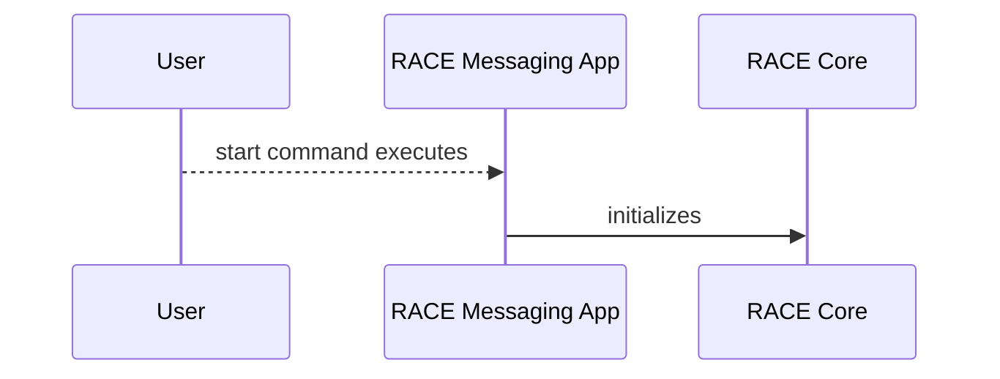

# **Resilient Anonymous Communication for Everyone (RACE) [Project Name] Guide**

## **Table of Contents**
TODO: generate once complete here http://ecotrust-canada.github.io/markdown-toc/

<br></br>

## **Terminology**
*add implementation-specific terms and acronyms*
<br></br>

## **Introduction**
*High-level Paragraph: State what this plugin accomplishes*
</br>

### **Design Goals**
### **Security Considerations**

<br></br>

## **Scope**
This developer guide covers the *[Project Name]* development model, building artifacts, running, and troubleshooting.  It is structured this way to first provide context, associate attributes/features with source files, then guide a developer through the build process.  

*additional detail as appropriate*
</br>

### **Audience**
*State assumptions about reader (e.g. familiarity with technologies utilized, etc)*

### **Environment**
*supported hosts and resource recommendations*

*(e.g. runs on Linux and Android hosts)*

*(e.g. X RAM, Y SSD recommended)*

### **License**
*State all license related information*

### **Additional Reading**
*Reference TBD User Guide, RACE dev guide, and appropriate TA dev guide*

*More specifically [Other File](relative/file/path.file)*
<br></br>

## **Implementation Overview**
*Top-level paragraph of what's in this project.  Additional detail on what this accomplishes (as appropriate)*

*Provide additional detail for terms defined in Terminology (as appropriate)*

*How is this expected to work in a RACE deployment?*

*Mermaid flow diagram(s) to illustrate internal state, and other interesting inter-workings*

There are several Mermaid diagrams in this document.  See https://docs.github.com/en/get-started/writing-on-github/working-with-advanced-formatting/creating-diagrams for more info about viewing Mermaid diagrams in github.  Mermaid diagrams can also be viewed in Visual Studio with Marketplace extensions: Markdown, and Markdown Preview Mermaid Support.  


<br></br>

## **Implementation Organization**
*description of each directory or file with detail sufficient to direct readers to specific attribute/functionality they may wish to inspect or change*

*map attributes to implementation in the following*
### **Feature/Attribute I**
  - *file/directory Q supports attribute I by ...*
  - *file/directory R supports attribute I by ...*
### **Feature/Attribute J**
  - *file/directory S supports attribute J by ...*
  - *file/directory T supports attribute J by ...*

<br></br>

## **How To Build**
*General build environment detail as appropriate (state what each artifact does, build considerations Linux vs Android)*

</br>

### **Artifact X**
*Artifact X is built in [insert build environment].  Artifact X is built with the following command(s)/script(s)*

*map artifact to deployed artifacts if this isn't a stand-alone deployable artifact*

*Info about build command(s)/script(s) (e.g. flags, context-sensitive env considerations)*

Command line example format (see markdown syntax https://www.markdownguide.org/cheat-sheet/):
```
cd <build_dir>
./do_stuff.py --flagX --flagY
cd <other_build_dir>
./do_other_stuff.sh --flagZ
```

#### **Parameters**
*build flags (what flags enable hardened deployment?  disable logging?)*

#### **Dependencies**
*state required packages, etc*

#### **Manifest**
*requirements - classify plugin for Core*

*channel properties - characterize operating profile (direct/indirect, loader/creator, expected latencies/bandwidth, roles, hints, etc)*

#### **Assumptions**
*as appropriate*

#### **Known Limitations**
*as appropriate*

#### **Tests**
*Brief: what requirements do test(s) cover*

*How to build and run tests*

</br>

### **Artifact Y**
*same as above*


<br></br>

## **How To Run**
*Stand-alone version and utilities (if applicable)*

*(preferably multiple) examples with common parameters, with statement about what it does or how it differs*

*See [appropriate TA dev] guide in [Additional Reading](additional-reading)*

</br>

### **Artifact X**
#### **Parameters**
*run flags (required or optional, and what they do, how do they change if running small vs large deployment)*

### **Artifact Y**
#### **Parameters**
*run flags (required or optional, and what they do, how do they change if running small vs large deployment)*

<br></br>

## **Troubleshooting**
*State general troubleshooting philosophy*

*How to verify functionality is working and enabled*

### **Build Tips**
*List of tips as appropriate*

### **Common Issues**
*Anything to avoid in general (e.g. time-related issues: necessary delays)*

### **Debugging Tips**
*in addition to those stated in RACE dev guide*

<br></br>

## **How Do I?**
*How do I change attribute/capability A-Z (e.g. replace algorithm, change flag effect, etc.)*
