# **Resilient Anonymous Communication for Everyone (RACE) Developer Guide**

## **Table of Contents**
- [**Resilient Anonymous Communication for Everyone (RACE) Developer Guide**](#resilient-anonymous-communication-for-everyone-race-developer-guide)
  - [**Table of Contents**](#table-of-contents)
  - [**Terminology**](#terminology)
  - [**Introduction**](#introduction)
    - [**Design Goals**](#design-goals)
    - [**Security Considerations**](#security-considerations)
  - [**Scope**](#scope)
    - [**Audience**](#audience)
    - [**Environment**](#environment)
      - [**Supported Hosts**](#supported-hosts)
      - [**Supported Clients**](#supported-clients)
      - [**Supported Servers**](#supported-servers)
      - [**Resource Recommendations**](#resource-recommendations)
    - [**License**](#license)
    - [**Additional Reading**](#additional-reading)
  - [**Development Model**](#development-model)
    - [**Deployment**](#deployment)
    - [**Node**](#node)
      - [**Genesis Node**](#genesis-node)
      - [**Bootstrapped Node**](#bootstrapped-node)
    - [**Plugins**](#plugins)
      - [**NetworkManager Plugins**](#networkmanager-plugins)
      - [**Comms Plugins**](#comms-plugins)
      - [**ArtifactManager Plugins**](#artifactmanager-plugins)
    - [**Channels**](#channels)
    - [**Links**](#links)
    - [**Connections**](#connections)
    - [**Core**](#core)
    - [**Concept of Operations**](#concept-of-operations)
      - [**API Usage Examples**](#api-usage-examples)
        - [**Connection Initialization**](#connection-initialization)
        - [**Sending a Message**](#sending-a-message)
        - [**Receiving a Message**](#receiving-a-message)
        - [**Closing Connections**](#closing-connections)
        - [**Node Bootstrapping**](#node-bootstrapping)
  - [Project Structure](#project-structure)
    - [External Dependencies](#external-dependencies)
      - [`ext-builder`](#ext-builder)
      - [`ext-build-action`](#ext-build-action)
      - [`ext-*`](#ext-)
    - [RACE SDK](#race-sdk)
      - [`race-docs`](#race-docs)
      - [`race-images`](#race-images)
        - [`compile`](#compile)
        - [`runtime-android-arm64-v8a`](#runtime-android-arm64-v8a)
        - [`runtime-android-x86_64`](#runtime-android-x86_64)
        - [`runtime-linux`](#runtime-linux)
      - [`race-core`](#race-core)
        - [`race-cmake-modules`](#race-cmake-modules)
        - [`racesdk`](#racesdk)
          - [`common`](#common)
          - [`core`](#core-1)
          - [`docker-image`](#docker-image)
          - [`java-shims`](#java-shims)
          - [`language-shims`](#language-shims)
          - [`racetestapp-shared`](#racetestapp-shared)
          - [`storage-encryption`](#storage-encryption)
          - [`test-harness`](#test-harness)
        - [`race-node-daemon`](#race-node-daemon)
        - [`racetestapp-linux`](#racetestapp-linux)
        - [`raceclient-android`](#raceclient-android)
        - [`race-registry`](#race-registry)
        - [`race-python-utils`](#race-python-utils)
        - [`plugin-artifact-manager-twosix-cpp-local`](#plugin-artifact-manager-twosix-cpp-local)
        - [`plugin-*`](#plugin-)
      - [`race-in-the-box`](#race-in-the-box)
  - [**Building**](#building)
    - [Building race-images](#building-race-images)
    - [Building RACE core](#building-race-core)
    - [**Building race-in-the-box**](#building-race-in-the-box)
  - [**Running**](#running)
  - [**Remaining Work**](#remaining-work)
  - [**Troubleshooting**](#troubleshooting)
    - [**Build Tips**](#build-tips)
    - [**Common Issues**](#common-issues)
    - [**Logging**](#logging)
    - [**gdb**](#gdb)
    - [**Built In tests**](#built-in-tests)
  - [How Do I...](#how-do-i)
    - [Add a new external dependency?](#add-a-new-external-dependency)
    - [Test a change to a plugin?](#test-a-change-to-a-plugin)
    - [Test a change to an app?](#test-a-change-to-an-app)
    - [Test a change to the core?](#test-a-change-to-the-core)
    - [Test a change to the runtime images?](#test-a-change-to-the-runtime-images)
    - [Test a change to race-in-the-box?](#test-a-change-to-race-in-the-box)
    - [Change a plugin or core API?](#change-a-plugin-or-core-api)
    - [Change or add a RiB-triggered action?](#change-or-add-a-rib-triggered-action)

<small><i><a href='http://ecotrust-canada.github.io/markdown-toc/'>Table of contents generated with markdown-toc</a></i></small>


<br></br>

## **Terminology**
* **RACE**: Resilient Anonymous Communication for Everyone, the name of the program providing initial funding
* **RiB**: RACE in the Box.  RiB orchestrates testing a RACE network using a Docker-based deployment of RACE nodes
* **Node**: Any instance of RACE software connected to the RACE network, hosting either a client or server (e.g RiB Docker container, or physical device)
* **User/RACE Messaging App/Client App**: End-user sender or recipient of plain text.  Messaging App and Client App are used interchangeably.
* **Client**: Node that interacts with the User/RACE Messaging app with client-server connection(s)
* **Server**: Any node in a RACE network that does not directly interact with any User/RACE Messaging App, but handles routing of messages from one client to another
* **Kit**: A collection of platform-specific artifacts and supplementary files (manifests, scripts, etc.) providing an app or plugin
* **Plugin**: Executable artifact loaded during runtime (e.g. C++ library)
* **NetworkManager** (plugin): Handles message routing and network topology; e.g. node enrollment, MPC-based routing, and other cryptographic tasks
* **Comms** (plugin): Obfuscated communications, in both client-server and server-server modes
* **ArtifactManager** (plugin): Resilient artifact distribution over non-standard distribution channels
* **Core**: System integration (orchestration of Apps, the NetworkManager, Comms, and ArtifactManager plugins, and other artifacts)
* **Registry App**: Special-purpose client that responds to ArtifactManager messages, to indicate where plugins/artifacts reside in a RACE network
* **Exemplar**: Example implementation of a plugin (not to be confused with an exemplar image)
* **Channel**: A method of obfuscated communication
* **Link**: Potential connectivity between two or more nodes
* **Connection**: Allows sender to prioritize transmissions and set different timeouts for multiple connections over a link
* **Package**: Message payload with RACE header
* **Deployment**: A set of artifacts and parameters instantiated as a network of RACE nodes
* **Bootstrapping**: The secure, anonymous process by which a node joins a RACE network some time after network deployment
* **Introduction**: Process by which a trusted RACE node introduces a new node into a RACE network in a secure, anonymous fashion.  This is part of the bootstrapping process.  
* **Oblivious routing**: The act of RACE servers routing messages from one node to another without discovering the origin or destination of each message
* **MPC**: Multi-Party Computation

<br></br>

## **Introduction**
RACE is a distributed anonymous messaging system that communicates over an IP network.  RACE nodes use obfuscated communications to enable them to operate in adversarial network environments without being detected or blocked.  RACE supports sending client-to-client messages through a network of servers using oblivious routing techniques to provide metadata anonymity (hiding where a client message came from or went to).  RACE achieves this with two modes of communication: client-server, and server-server.  
</br>

### **Design Goals**
RACE was built with the following design goals:
* The primary purpose of RACE is to avoid large scale compromise
* Resilient to limited participant compromises, and large-scale, real-time deep packet inspection
* Can exist completely within an adversarial network
* Secure, anonymous network communications
    * Provides confidentiality, integrity, and availability of messaging
    * Preserves privacy to any participant in the system

### **Security Considerations**
It is assumed that RACE is public knowledge.  This includes client software, server software, and technical specifications for the whole system.  

The primary purpose of the RACE system is to avoid large-scale compromise.  Security should be maintained even if RACE component systems and network traffic can be observed, and possibly selected for compromise, throughout the network environment.  The security guarantees for the RACE system should correspond to the standard notions of confidentiality, integrity, and availability.

| Type of Security | Attribute | Notes |
| ----------- | ----------- | ----------- |
| Confidentiality | User Messages | Only the sender and receiver of a message can see content |
|                 | User Message Metadata | Confidentiality of who talks to whom and when |
|                 | Unobservable Communication | Client usage should not be inferable unless the host device is compromised |
|                 | Unobservable Service Node Participation | App(s) executing service node functionality should not be inferable unless the host device is compromised |
| Integrity | User Messages | User messages cannot be changed in transit |
| Availability | User Messages | User messaging should continue despite partial compromise or blocking of the server network |

<br></br>

## **Scope**
This developer guide covers the Core development model, building artifacts, running, and troubleshooting.  It is structured this way to first provide context, relate attributes to implementation, and then guide a developer through the build process.  It additionally includes a "how do I" section as a place to go for common tasks.  It is intended to compliment the README.md files for any given step in the build process, rather than duplicating text.  

Plugins are mentioned where they interface with Core, and in the context of exemplars.  See [**Additional Reading**](#additional-reading) for more detail.

There are several Mermaid diagrams in this document.  See https://docs.github.com/en/get-started/writing-on-github/working-with-advanced-formatting/creating-diagrams for more info about viewing Mermaid diagrams in github.  Mermaid diagrams can also be viewed in Visual Studio with Marketplace extensions: Markdown, and Markdown Preview Mermaid Support.  
</br>

### **Audience**
RACE supports plugin development on several host architectures, for several popular languages: C++, Java, GoLang, Rust, and Python.  Familiarity with Docker, Cmake, Clang, C++, and any plugin language of interest is assumed.  It is also assumed that the reader is familiar with the [RACE Quickstart Guide](https://github.com/tst-race/race-quickstart/blob/main/README.md)


### **Environment**
#### **Supported Hosts**
RACE artifacts were built on the following host platforms:
* x86_x64 (built using Ubuntu)
* arm64-v8a/aarch64 (built using Apple M1)

#### **Supported Clients**
* Ubuntu 20.04 (arm-v8a/aarch64 and x86_64)
* Android OS versions 10, 11 and 12 

#### **Supported Servers**
* Ubuntu 20.04 (arm-v8a/aarch64 and x86_64)

#### **Resource Recommendations**
Building RACE Docker containers is resource intensive.  Although building with less is possible, the following is advisable to minimize build times and pruning Docker images.
* 32GB RAM
* 400GB HDD or SSD

Note that these parameters can be set in Docker Desktop > Preferences > Resources.


### **License**
All RACE Core software is licensed under the Apache License, Version 2.0.  You may obtain a copy of the License at http://www.apache.org/licenses/LICENSE-2.0


### **Additional Reading**
- [RACE Quickstart](https://github.com/tst-race/race-quickstart/blob/main/README.md)
- [What is RACE: The Longer Story](https://github.com/tst-race/race-docs/blob/main/what-is-race.md)
- [Full list of RACE Channels](https://github.com/tst-race/race-docs/blob/main/race-channels.md)
- [RiB Documentation](https://github.com/tst-race/race-in-the-box/tree/2.6.0/documentation)

<br></br>

## **Development Model**
RACE is partitioned into four technical areas that intersect at their respective interfaces.  Namely: NetworkManager, Comms, Core, and ArtifactManager as defined in [**Terminology**](#terminology).  The definitions are duplicated here for ease of reading.  
* NetworkManager (plugin): Handles message routing and network topology; e.g. node enrollment, MPC-based routing, and other cryptographic tasks
* Comms (plugin): Obfuscated communications, in both client-server and server-server modes
* ArtifactManager (plugin): Resilient artifact distribution over non-standard distribution channels
* Core: System integration (orchestration of Apps, the NetworkManager, Comms, and ArtifactManager plugins, and other artifacts)

</br>

### **Deployment**
Message routing, network communications, and artifact distribution are realized as plugins that interface through the Core RACE logic.  There are a number of plugins and other artifacts required to run a RACE node.  This collection of artifacts and the parameters of the nodes running them is referred to as a deployment.  A deployment contains the following required and optional artifacts:
* (Required) Core
  * Required to coordinate plugin interactions
* (Required) one indirect channel
  * Required for client-server communication
  * Responsible for providing covert communications among nodes
* (Optional) one or more additional channels
  * Can be direct or indirect (direct channels are only used for server-server connectivity)
  * Provides additional covert communication methods for nodes
* (Required) one or more user-facing client applications
  * Android-app and/or linux-app for client usage
* (Optional) ArtifactManager plugin
  * Optionally used for resilient application distribution in absence of standard app distribution methods such as Google Play
  * A registry-app if the ArtifactManager Plugin requires it
* (Required) RaceNodeDaemon
  * Required for a RiB deployment
  * Background task used to coordinate orchestration tasks and report node status in a RiB deployment
* (Required) one or more client nodes
  * Required for clients to participate in a deployment (sending client-client messages)
* (Required) one or more server nodes
  * Provides anonymous client-client message routing 

</br>

### **Node**
A node is any instance of RACE software connected to the RACE network, hosting either a client or server.  Nodes are also delineated based on how they are started in a RACE network.  RACE facilitates declaring all nodes that should start upon network initialization.  Nodes can also join a RACE network some time after network initialization through the bootstrapping process.  

#### **Genesis Node**
A genesis node is one that is started during RACE network initialization.  The concept of genesis nodes is motivated by the following:
 * Many existing Comms plugins don't support networks of just one node
 * There may be differences between servers and clients (e.g. servers can only bootstrap servers and clients can only bootstrap other clients), so there still needs to be a way to connect the clients and servers

#### **Bootstrapped Node**
A bootstrapped node is one that joins a RACE network by being introduced by another node in a RACE network after network initialization.  A trusted node in a RACE network can initiate the introduction process of a new trusted node into its RACE network.  It should be done so in a secure, anonymous fashion.  

</br>

### **Plugins**
Plugin is the abstract term reserved for executable artifacts that are loaded at runtime.  Each plugin instance runs on its own thread in each node (excepting a Comms plugin that is only appropriate for servers, such a plugin will not run in a client node).

#### **NetworkManager Plugins**
NetworkManager plugins manage the topology of the RACE network and handle routing client messages.  They define the means to accept new nodes into a RACE network, as well as perform cryptographic operations on messages.  The NetworkManager plugin also selects which channels to communicate through.  A NetworkManager plugin is required for client-server interaction.  

#### **Comms Plugins**
Comms plugins provide one or more channels for covertly communicating. Each channel represents a different method of performing covert communication. Generally it is recommended that each Comms plugin provide a single channel for simplicity, but multiple channels can be provided by a single plugin if there are runtime resource advantages to doing so (e.g. sharing a single instance of an ML model).  Comms plugins are used for server-server interactions.  

#### **ArtifactManager Plugins**
Stores and distributes encrypted RACE artifacts in the absence of standard app deployment models.  
</br>

### **Channels**
Channels are a method of covert communication (e.g. covert messages steganographically encoded [as/into] jpeg images and transferred via emails).  From the Comms and NetworkManager perspectives: this identifies how communication is achieved, but does not include the transport.  Channels have a number of different security and performance properties, the most important of which is whether they are *direct* or *indirect*.  *Direct* channels use an IP connection between two nodes.  *Indirect* channels make IP connections to one or more 3rd-party services of some kind (e.g. sending an email between two nodes would be an *indirect* channel). 

**Caveat**: Indirect channel(s) are required for client-server interaction.  Indirect channel(s) are required so that a malicious client does not learn the IP address of servers, because we assume there will be many malicious clients.  Server-server interactions can be accomplished over both direct and indirect channels.  

### **Links**
A channel can have one or more links.  Links represent potential connectivity between two or more nodes.  The link implements the transport.  Links should be designed to operate entirely within a RACE network.  

### **Connections**
A link can have one or more connections.  Connections allow NetworkManager plugins to prioritize transmissions.  This allows high-priority messages to bypass another queue of pending messages to send.  This feature exists for the sending side of a link.  Although they are used on both ends in practice.  On the receiving side there is no distinction among receiving connections, so only one receiving connection should be opened.

**Caveat**: Packages will be dropped if the recipient does not open a connection.

</br>

### **Core**
The Core is the orchestrator of the various plugins and other artifacts.  This is accomplished by calling into plugins, and handling callbacks, as defined in this SDK.
</br>

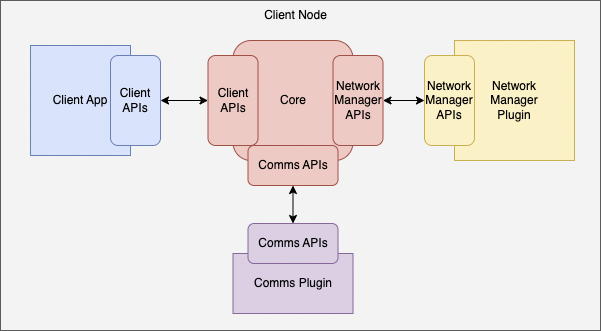
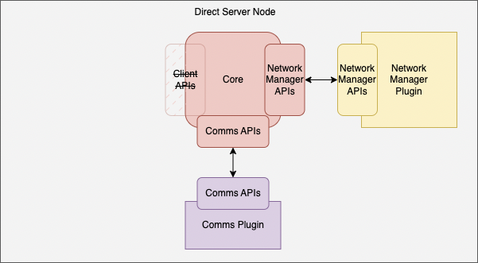
</br>
*plugin APIs*

</br>
From the perspective of the Core: channels, links, and connections are represented as strings.  Each Comms plugin is usually analogous to a channel.  Each channel can have one or more links.  Each link can have one or more connections.  Each connection can send or receive one or more packages.  

</br>

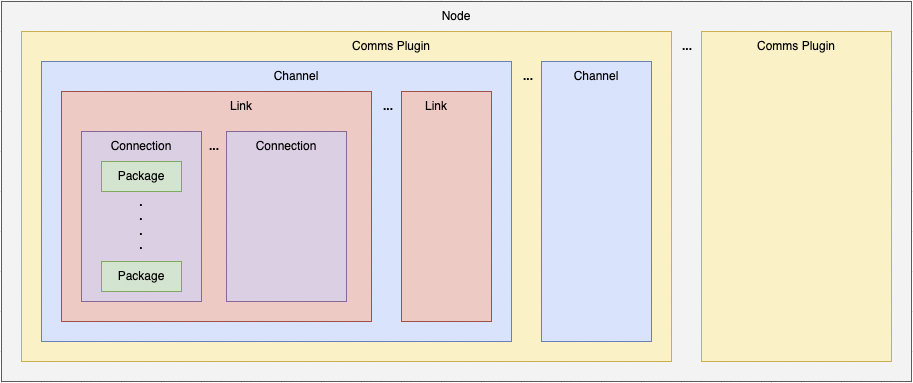
</br>
*organization of plugins, channels, links, connections, and packages*

</br>

### **Concept of Operations**
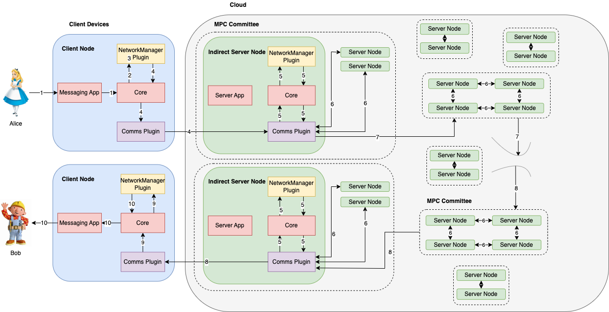
</br>
*simplified client-client messaging example to clarify interactions between performers in the simplest use case of an established RACE network and start discovering cross-plugin requirements*
</br>
*server nodes are direct server nodes unless otherwise specified*

</br>

1. Alice enters message into Messaging App GUI on Client Node (e.g. Android phone, or browser)
2. Core passes Alice's message and ultimate recipient Persona to the NetworkManager
3. The NetworkManager encrypts Alice's message for ultimate recipient, and next intermediate hop, by whatever means it chooses
4. The NetworkManager sends the encrypted message to a Comms plugin to be sent over a logical link to a server node
    - This server node is discovered during to a prior bootstrapping process by the client node
    - The exact nature of this server node is determined during the bootstrapping process (e.g. if NetworkManager prescribes multiple types of Sever Nodes, the bootstrapping process needs to ensure that the correct type of server is bootstrapped)
    - The architecture does not preclude multiple server node recipients as part of this step (perhaps to all members of an MPC clique, to ensure failure due to a single Byzantine node)
5. The server node's NetworkManager receives the message and removes intermediate encryption
6. The NetworkManager plugins within MPC Cliques/Committees make repeated use of Comms links to perform necessary multiparty computations
7. The message may be routed to further committees - of different types if the NetworkManager design calls for it
8. Eventually the message reaches a server with an indirect channel that the recipient can receive messages from, and the message is received by Bob's Comms plugin
9. The recipient client's NetworkManager removes the encryption (performed in step 3), then passes the plain text message to Core to serve to the recipient user.
10. Alice's original plain text message is passed from Core to the Messaging App on the Client Node (e.g. Android phone, or browser)

</br>

#### **API Usage Examples**
The following examples illustrate API call usage between Core and the other plugins.  All plugin interactions are passed through the Core APIs.  So there are more API calls than one might initially expect.  

It's important to remember that the logic that follows from each plugin API call is implementation specific.  The following examples assume that the exemplar TwoSix channels are used.  However, no NetworkManager implementation logic is assumed.  

</br>

##### **Connection Initialization**
Assuming Bob is a trusted RACE network participant, Bob must enable the channel(s), create the link(s), and open the connection(s) in which Bob would like the Comms plugin to receive on.  

1. The Comms plugin requests that the NetworkManager to activate the specified channel
2. The Comms plugin can optionally prompt the Messaging App, or request user input from the Messaging App as many times as appropriate
3. The Comms plugin requests that the NetworkManager to create 1 or more links for the opened channel.  Note that the send side will load (not create) remote receive link(s).  
4. The Comms plugin requests that the NetworkManager to open a connection for each link (receive side only needs 1 connection)

Prerequisites:
* Bob's Core, NetworkManager plugin, and Comms plugins are fully initialized (via `initRaceSystem()` API calls)
* Bob had previously registered with the RACE network
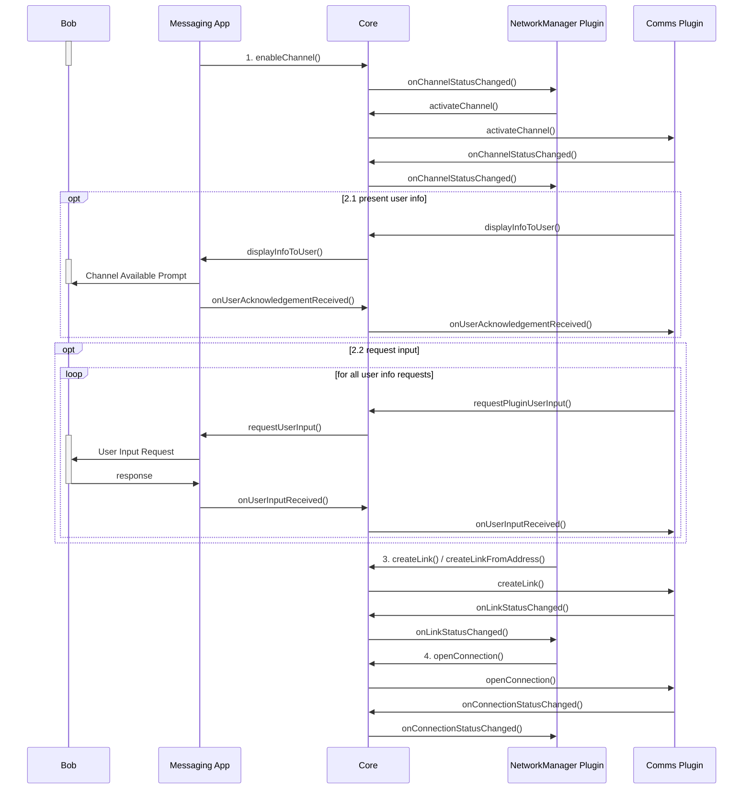

</br>

##### **Sending a Message**
Once Bob is ready to receive messages from Alice, Alice can send a message to Bob as follows.

Prerequisites:
* The contact information (persona) for Bob is already known to Alice's Messaging App
* Alice's Messaging App has already registered with the RACE network
* Alice's Core, NetworkManager plugin, and Comms plugins are fully initialized

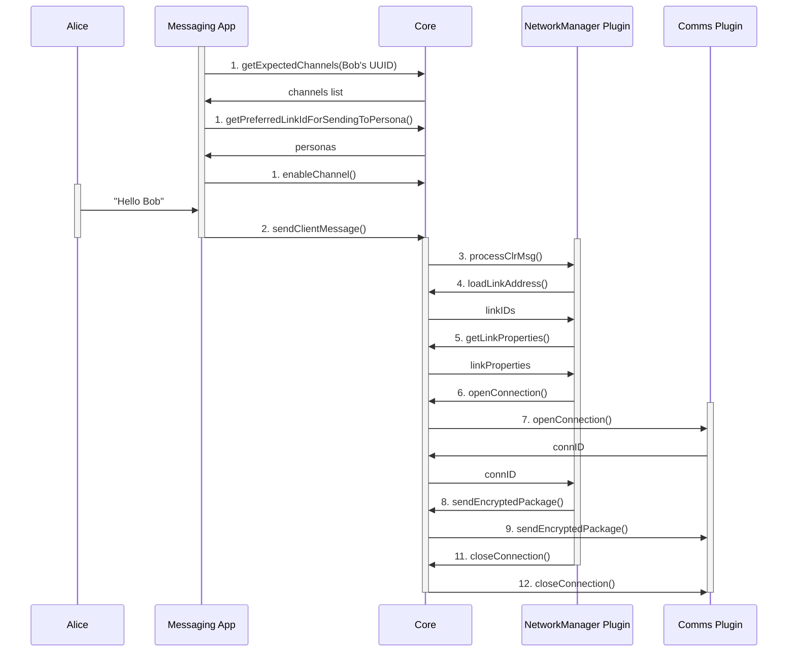

</br>

##### **Receiving a Message**
Alice's Comms plugin delivers the message to Bob as result of step 9 in the previous diagram.  The way in which the message is presented to Bob is as follows, assuming:
* Bob's Core, NetworkManager plugin, and Comms plugins are fully initialized ( see [**Connection Initialization**](#connection-initialization) )
* The contact information (persona) for Alice is already known to the Messaging App
* Bob's Messaging App has already registered with the RACE network
* Link Profiles have been pre-populated with information about each of the links available on the initialized Comms plugin transports, including:
  * Details necessary for the transport to generate a connection object from the link
  * Link Properties used by the Network Manager to differentiate and select links

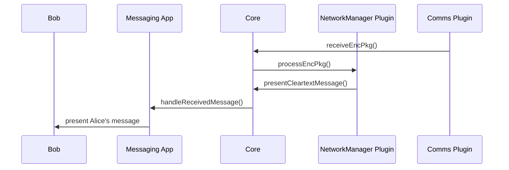

</br>

##### **Closing Connections**
Once Bob is done, the following illustrates the inter-workings of leaving the RACE network.  
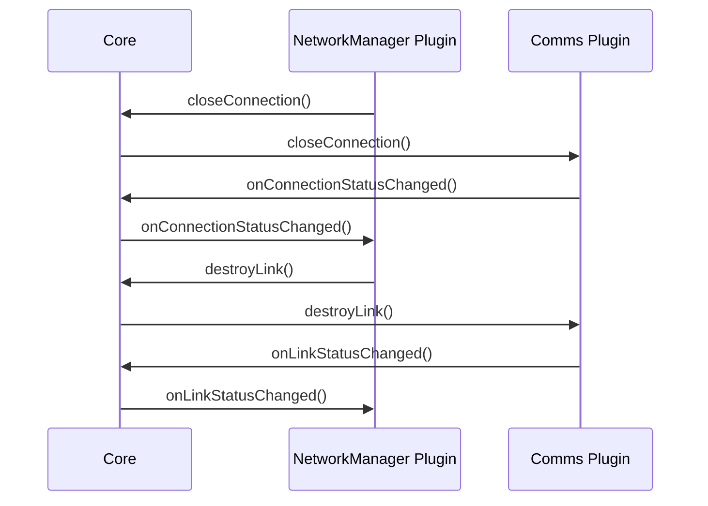

<br></br>

##### **Node Bootstrapping**
What if Alice wants Bob to interact in an existing RACE network for the first time?  Bob must first be introduced into the RACE network by a trusted participant (Alice) through the bootstrapping process.  

The first step in introducing a participant into a RACE network is when the trusted participant calls the `prepareToBootstrap()` API call with the bootstrapping information (device information, channel ID, passphrase).  This should, in turn, open a bootstrap connection within the introducer node so that messages can be received from the node being introduced.  Alice's NetworkManager specifies which channels Bob will receive on.  Alice fetches the selected channels from the ArtifactManager.  Bob downloads the bootstrap package (plugins, app, and configuration) from Alice independent of the RACE app (e.g. curl, browser).  Bob starts the RACE Messaging App for the first time, and opens a connection to Alice in order to continue the NetworkManager-defined bootstrapping process.  

All NetworkManager logic is based on the `plugin-comms-twosix-cpp` exemplar in the following examples.  Similarly, all Comms logic is based on the `plugin-network-manager-twosix-cpp`.  It's important to note that the logic in the following bootstrapping sequence diagrams are plugin defined.  Thus, these examples only serve only to illustrate how bootstrapping ***could*** work.  


Prerequisites:
* Alice had previously registered as a trusted participant with the RACE network (either as a genesis node, or had been bootstrapped into the RACE network)
* Alice's Core, NetworkManager plugin, and Comms plugins are fully initialized (via `initRaceSystem()` API calls)
* Alice had already established connections with the server committee

Assume Alice wants to introduce Bob into the RACE network using TwoSix-defined direct, indirect, and bootstrap channels.  The following diagram shows how Alice's node would interact with Core APIs in the bootstrapping process.  
1. Alice sends Bob's bootstrap information to Core, and adds configuration information to the bootstrap package
2. Comms creates the bootstrap link
3. NetworkManager adds NetworkManager-specific information (e.g. link addresses, personas, etc) to the bootstrap package from existing configuration
4. Open a direct receive bootstrap connection to listen for messages from Bob
5. Send link-create request to committee servers, after which each server responds with a link address
6. Alice gathers the artifacts that Bob will use from the ArtifactManager
7. Alice POSTs these artifacts somewhere for Bob to download (e.g. HTTP GET / CURL)
8. Present address to Alice so Alice can tell Bob where to download the bootstrap package
9. Core opens direct bootstrap connection to receive the bootstrap message from Bob
10. Receipt of bootstrap message from Bob (persona, and other implementation-specific information).  This corresponds with step 5 in the introducee's sequence diagram below.
11. Core closes the connection opened in step 9 upon receipt of the bootstrap message
12. Send the add-persona request to committee servers on behalf of Bob (received in step 10)
13. Forward each of Bob's load-link-address requests to a committee server.  This is only necessary if Bob needs a server in the committee to load Bob's link address.  
14. Receive Bob's destroy-link-request (indicates Bob is finished with the bootstrap process)
15. Close the connection opened in step 4
16. Destroy the bootstrap link created in step 2
17. Present status to client app / user
18. Alice stops hosting artifact POST from step 7

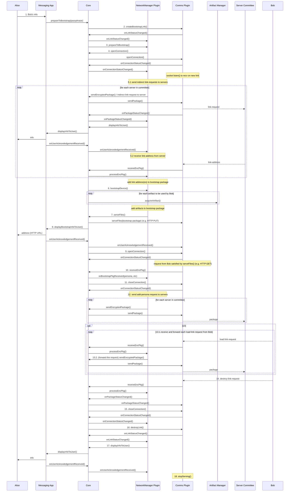

</br>

Bob, the node being introduced, will request the artifacts outside of the Messaging App (e.g. curl, browser), then load and initialize these artifacts.  This corresponds with Alice's step 7 (`serveFiles()`) in the previous introducer's bootstrap sequence diagram.  These artifacts will interact in the bootstrap process as follows.
1. Load and initialize the ArtifactManager, Comms, and NetworkManager plugins
2. Activate the Comms bootstrap and indirect channels
3. Load the indirect link address(es) and open bidirectional connection(s) to all committee servers
4. Load the bootstrap link address and open the connections for the bootstrap channel to receive from Alice.  Note that only one connection may be opened if the link is bidirectional.  
5. Send bootstrap package to Alice on bootstrap channel/link/connection (corresponds to step 10 in the introducer sequence bootstrap diagram)
6. Create indirect bidirectional link with committee servers and open indirect bidirectional connection with committee servers for subsequent messaging
7. Send load-link-address request to Alice to forward onto servers
8. Send request to destroy the bootstrap link (in response to `onPackageStatusChanged()` from previous step)
9.  Close the bootstrap connection, destroy the bootstrap link
10. The plugin notifies the app that it is ready 

* All the while, presenting status information to the user (all but the last notification is omitted in this sequence diagram)
* At this point Bob's device has all artifacts and persistent communication-related information to (a) send and receive messages to and from other RACE nodes and (b) start a new messaging session in the future

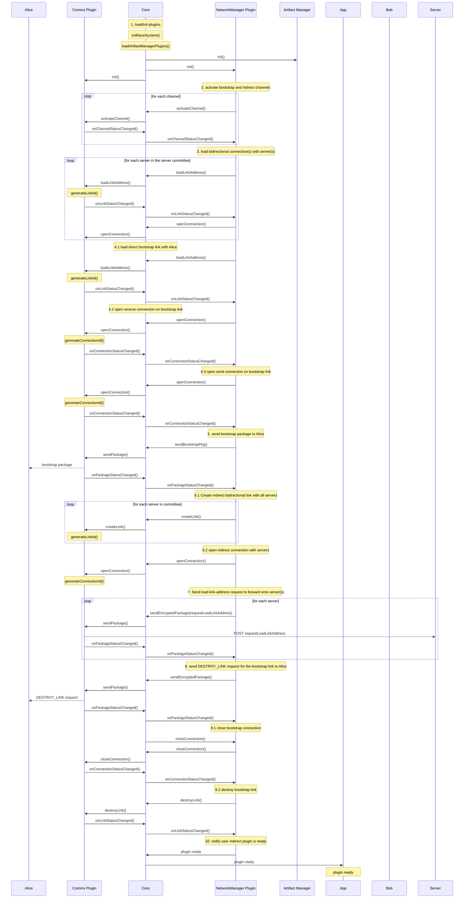

</br>

During ***this*** bootstrap process, the servers interact with Alice and Bob as follows.  
1. The server receives the link-create request from Alice, the introducer (corresponds with step 5 in introducer's bootstrapping sequence diagram)
2. The server creates the link to respond to Alice with.
3. The server replies to the link-create request with the new link information (corresponds with step 5 in the introducer's bootstrapping sequence diagram)
4. The server receives the add-persona request from Alice (corresponds with step 12 in introducer'**s** bootstrapping sequence diagram)
5. The server, in turn, opens a bidirectional bootstrap connection for communication with the new client (Bob)
6. Notify server app that the NetworkManager is ready.
7. The server receives a load-link-address request from Bob (corresponds with step 7 in the introducee's (Bob) sequence diagram, and step 13 in the introducer's sequence diagram)
8. The server loads the indirect bidirectional link to communicate with Bob
9. The server opens a corresponding bidirectional connection with Bob
10. The server notifies the app that the plugin is ready


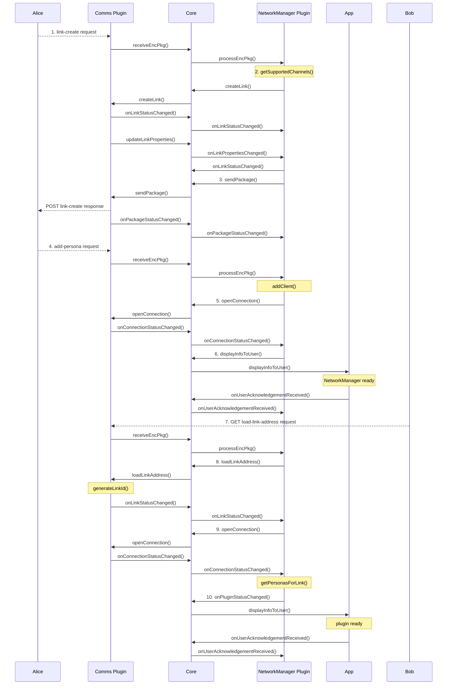

## Project Structure

RACE is organized into many repositories. These repositories may produce Docker
images, binary artifacts, or plugin/app kits that may be used in RACE
deployments.

### External Dependencies

RACE depends on a number of open source libraries and tools referred to as
external dependencies. The following repositories support the building of these
external dependencies.

#### [`ext-builder`](https://github.com/tst-race/ext-builder)

This repository produces a Ubuntu-based Docker image with all compilers and tools
necessary to build the external dependencies. It provides a Python library that
can be used to write a build script for an external dependency using a standard
input/output format.

See the readme in the `ext-builder` repository for more information about how
to write a build script or to execute an external dependency build.

#### [`ext-build-action`](https://github.com/tst-race/ext-build-action)

This repository contains a GitHub action and re-usable workflow to support
building of external dependencies using the `ext-builder`.

See the readme in the `ext-build-action` repository for more information about
setting up a GitHub actions workflow for an external dependency.

#### `ext-*`

The following are the external dependencies used by RACE.

* [`ext-boost`](https://github.com/tst-race/ext-boost)
* [`ext-cppcheck`](https://github.com/tst-race/ext-cppcheck)
* [`ext-cpprest`](https://github.com/tst-race/ext-cpprest)
* [`ext-curl`](https://github.com/tst-race/ext-curl)
* [`ext-ffmpeg`](https://github.com/tst-race/ext-ffmpeg)
* [`ext-gdb`](https://github.com/tst-race/ext-gdb)
* [`ext-gf-complete`](https://github.com/tst-race/ext-gf-complete)
* [`ext-googletest`](https://github.com/tst-race/ext-googletest)
* [`ext-jaeger-client-cpp`](https://github.com/tst-race/ext-jaeger-client-cpp)
* [`ext-jel2`](https://github.com/tst-race/ext-jel2)
* [`ext-jerasure`](https://github.com/tst-race/ext-jerasure)
* [`ext-json-c`](https://github.com/tst-race/ext-json-c)
* [`ext-jsoncpp`](https://github.com/tst-race/ext-jsoncpp)
* [`ext-libarchive`](https://github.com/tst-race/ext-libarchive)
* [`ext-liberasurecode`](https://github.com/tst-race/ext-liberasurecode)
* [`ext-libffi`](https://github.com/tst-race/ext-libffi)
* [`ext-libzip`](https://github.com/tst-race/ext-libzip)
* [`ext-nginx`](https://github.com/tst-race/ext-nginx)
* [`ext-nlohmann-json`](https://github.com/tst-race/ext-nlohmann-json)
* [`ext-ntl`](https://github.com/tst-race/ext-ntl)
* [`ext-openssl`](https://github.com/tst-race/ext-openssl)
* [`ext-opentracing-cpp`](https://github.com/tst-race/ext-opentracing-cpp)
* [`ext-pbc`](https://github.com/tst-race/ext-pbc)
* [`ext-python`](https://github.com/tst-race/ext-python)
* [`ext-sodium`](https://github.com/tst-race/ext-sodium)
* [`ext-swig`](https://github.com/tst-race/ext-swig)
* [`ext-thrift`](https://github.com/tst-race/ext-thrift)
* [`ext-yaml-cpp`](https://github.com/tst-race/ext-yaml-cpp)

### RACE SDK

The following repositories support the development and testing of RACE plugins.

#### [`race-docs`](https://github.com/tst-race/race-docs)

This repository contains high-level developers and users guides for RACE.

#### [`race-images`](https://github.com/tst-race/race-images)

This repository produces several Docker images used for developing RACE. Each
of the following directories of the repository represent a Docker image.

##### `compile`

Produces the `race-compile` Docker image used for compiling the RACE core. It
extends the `ext-builder` image to include all external dependency libraries and
compilers for all supported plugin languages.

##### `runtime-android-x86_64`

Produces the `race-runtime-android-x86_64` Docker image used for running
emulated Android client nodes in a RiB deployment. It extends a `ubuntu` image
to include the Android emulator, an Android virtual device, and runtime
configuration (e.g., systemd) needed to support running the emulated device.

##### `runtime-linux`

Produces the `race-runtime-linux` Docker image used for running Linux client and
server nodes in a RiB deployment. It extends a `ubuntu` image to include all
external dependency libraries and runtime configuration (e.g., systemd) needed
to support running the RACE app.

#### [`race-core`](https://github.com/tst-race/race-core)

This repository contains the Core SDK, test applications, stub and exemplar
plugin implementations, and standin services to support development of RACE.

The following directories of the repository represent a sub-component of the
RACE core:

##### `race-cmake-modules`

This directory contains CMake support files used for building RACE core.

##### `racesdk`

This directory contains the logic and APIs to interface with all other RACE
plugins.  The APIs are comprised of interfaces, libraries, and the language
bindings necessary for plugin development.

`racesdk` contains the following subdirectories:

###### `common`

* Interface headers and type definitions for plugins and core APIs
  * Types include equality operators and to/from string conversion functions,
    where applicable
* Common utilities, such as logging and OpenTracing helper functions

The source in this directory produces the following artifacts:
* `libraceSdkCommon.so`

###### `core`

* Implementation of core APIs
* Dynamic plugin loading
* Comms channel component management
* Logic for validating and routing calls between the application and plugins

The source in this directory produces the following artifacts:
* `libraceSdkCore.so`

###### `docker-image`

Dockerfile and script to build `race-sdk` Docker image.

###### `java-shims`

JNI bindings to support interoperability between Java plugins or apps and the
C++ RACE core.

The source in this directory produces the following artifacts:
* `libRaceJavaShims.so`
* `racesdk-java-shims-1.jar`

###### `language-shims`

SWIG-based bindings to support interoperability between Golang and Python
plugins and the C++ RACE core.

**Note:** Python bindings exist for the Network Manager and Comms plugin
interfaces, while Golang bindings only exist for the Comms plugin interface.

The source in this directory produces the following artifacts:
* `networkManagerPluginBindings.py`
  * Python module containing the Network Manager plugin and core APIs
* `_networkManagerPluginBindings.so`
  * Python Network Manager plugin and core native bindings
* `commsPluginBindings.py`
  * Python module containing the Comms plugin and core APIs
* `_commsPluginBindings.so`
  * Python Comms plugin and core native bindings
* `commsPluginBindingsGolang.go`
  * Golang module containing the Comms plugin and core APIs
* `commsPluginBindingsGolang.so`
  * Golang Comms plugin and core native bindings

###### `racetestapp-shared`

Library to allow headless (i.e., there may not be any UI for the app)
interaction with RACE test apps (both Linux and Android) through a backdoor
mechanism using RiB and the node daemon.

The source in this directory produces the following artifacts:
* `libraceTestAppShared.so`

###### `storage-encryption`

* Library to support AES encrypted access to content on the local filesystem
* Command-line interface application to encrypt or decrypt files

The source in this directory produces the following artifacts:
* `libraceSdkStorageEncryption.so`
* `racesecli`

###### `test-harness`

Library to support bypassing the Network Manager plugin to directly test Comms
plugin functionality.

The source in this directory produces the following artifacts:
* `libPluginNMTwoSixTestHarness.a`

##### `race-node-daemon`

This directory contains the source for the node daemon application:

* Provides mechanisms to remotely report node status and receive remote commands
* This capability is for Linux clients, Linux servers, and Android clients
* Enables test automation across all nodes within a RiB deployment
* Is not used in real-world deployments

##### `racetestapp-linux`

This directory contains the source for the Linux test application:

* Linux client and server app to support headless testing by interfacing with
  the node daemon
* Is not used in real-world deployments

##### `raceclient-android`
This directory contains the source for the Android client application:

* Suitable for both RiB **and** real-world deployments
* Supports headless test automation by interfacing with the node daemon

##### `race-registry`

This directory contains the source for an exemplar RACE registry app.

* This is an example of an alternate RACE client functionality, in this case an automated lookup service for finding new RACE plugins that combines with the TwoSix Artifact Manager exemplar plugin
* Is not used in real-world deployments

##### `race-python-utils`

This directory contains Python libraries for use in exemplar plugin config
generation scripts that are invoked by RiB.

##### `plugin-artifact-manager-twosix-cpp-local`

This directory contains the source for an Artifact Manager plugin implementation
that re-uses locally-existing artifacts.

##### `plugin-*`

Each of the following directories contains an exemplar or stub implementation
of a RACE plugin for all supported plugin languages:

* `plugin-artifact-manager-twosix-cpp` - C++-based Artifact Manager plugin
  example
* `plugin-network-manager-twosix-cpp` - C++-based Network Manager plugin example/stub
* `plugin-network-manager-twosix-python` - Python-based Metwork Manager plugin example
* `plugin-comms-twosix-cpp` - C++-based Comms plugin example/stub
* `plugin-comms-twosix-decomposed-cpp` - C++-based decomposed Comms plugin
  example/stub
* `plugin-comms-twosix-golang` - Golang-based Comms plugin example
* `plugin-comms-twosix-java` - Java-based Comms plugin example
* `plugin-comms-twosix-python` - Python-based Comms plugin example
* `plugin-comms-twosix-rust` - Rust-based Comms plugin example

#### [`race-in-the-box`](https://github.com/tst-race/race-in-the-box)

This repository contains the race-in-the-box (RiB) tool:

* Creation and management of ad-hoc test environments
  * Single-host deployments on the local host
  * Multi-host deployments on AWS infrastructure
* Orchestration and execution of automated testing

See the documentation in the `documentation` folder of the `race-in-the-box`
repository for more information about using RiB.

## **Building**
RACE artifacts are built with Docker.  Docker is used as means to create a test overlay network.  

There are several build steps in the build process (explained below).  Users can
build all images in `race-images`, then simply run `build.sh` to build all of
RACE core locally.

Take note of the [**Troubleshooting**](#troubleshooting) section below before trying to debug.  

</br>

### Building race-images

Each directory that contains a `Dockerfile` also contains a `build_image.sh`
script that will build the image defined by that directory and tag it using the
current git branch of the `race-images` repository.

```sh
(cd compile && ./build_image.sh)
(cd runtime-linux && ./build_image.sh)
(cd runtime-android-x86_64 && ./build_image.sh)
(cd runtime-android-arm64-v8a && ./build_image.sh)
```

**Note:** The Android x86 image can only be built from an x86 host. The Android
ARM image can be built from either an x86 host or an ARM host.

### Building RACE core

The RACE core artifacts (SDK libraries, apps, exemplars) are built within the
`race-compile` Docker image using the `docker_run.sh` and `build.sh` scripts.

The `docker_run.sh` script abstracts the details of starting the `race-compile`
container, mapping `pwd` into the docker image, etc.

The `build.sh` script provides a `--help` flag to describe non-default options.
Note users will need to specify which architecture they are building for when
using this script.

```sh
./docker_run.sh -c bash --local --version <race-compile-tag>
?> ./build.sh
```

### **Building race-in-the-box**
`race-in-the-box/rib/bin/rib` is built with `race-in-the-box/docker-image/build_race_in_the_box.sh'.  

<br></br>

## **Running**
The [RACE Quickstart guide](https://github.com/tst-race/race-quickstart/blob/main/README.md) walks through running test deployments based on prebuilt/prepackaged docker images and plugin kits hosted on Github. The [RiB Documentation](https://github.com/tst-race/race-in-the-box/tree/2.6.0/documentation) provides more comprehensive descriptions of all the RiB commands and how to use them to trigger different RACE software behaviors in the RiB-based test deployment environment. Here we just provide basic instructions for how to run test deployments based on locally build images and plugins, and a description of what would be necessary to run RACE outside of the RiB test environment.

### Using Local Builds

To use local builds of images, simply specify the appropriate docker image name. In general, docker images built locally by the RACE repos will have the default `docker.io` registry and are tagged with the name of the branch the repo is on. 

E.g. if you made a local branch named `mybranch` on of the `race-images` repo and then built `race-runtime-linux` and wanted to use it as the image that RACE servers are run in for a deployment, you would provide the following argument to the `rib deployment local create` command:

```
    --linux-server-image=race-runtime-linux:mybranch
```

To use a local build of a plugin, you specify a `local=/path/to/kit/in/rib/filesystem` argument. Generally any plugin build should create a top-level directory called `kit` that contains both the runtime artifacts and config-generation support code. The argument should provide the absolute path to that directory within the RiB container (RiB resolves this into a host path which is then volume-mounted into the RACE node containers at runtime).

E.g. assume you have made changes and built the `plugin-twosix-comms-cpp` plugin within the `race-core` repo, and that the `race-core` repo exists at the path `/code/race-core/` in RiB, you would provide the following argument to the `rib deployment local create` command:

```
    --comms-kit local=/code/race-core/plugin-comms-twosix-cpp/kit
```

### RACE outside RiB

The divide between the runtime RACE software and the test orchestration facilitated by RiB can be confusing. To aid in rapid prototyping and testing of RACE, RiB does a lot of heavy-lifting in configuring and deploying RACE software for testing. 

At runtime, the following things are what are actually necessary for RACE (i.e. would be necessary on a non-test deployment of RACE):

1. Dependencies installed in [race-runtime-linux Dockerfile](https://github.com/tst-race/race-images/blob/main/runtime-linux/Dockerfile) (note: some of these are only actually necessary for specific RACE plugins)
1. Core app and language shims, ([racetestapp.tar.gz bundle](https://github.com/tst-race/race-core/releases/download/2.6.0-beta-4/racetestapp-linux.tar.gz)
1. Network Manager, Artifact Manager, and Comms Plugins
1. Configuration files 

These pieces can actually be isolated from the filesystem of a RiB deployment by looking at the contents of the `plugins/linux-x86_64-server/` (or any other architecture/node-role combination) which contains items #2 and #3. The configuration files are bundled in .tar.gz files in the deployment `configs/` directory. _In principle_ these files could be manually copied to a separate linux device with the proper dependencies installed and run without issue. 

The main barrier to this "just working" is actually networking: by default, RiB constructs isolated network environments for both the RACE node containers and 3rd-party services (e.g. email servers, etc.) using docker networks, so these would not be reachable by external devices by default. This is why the bridged Android device mode requires use of OpenVPN on the Android device, to access the isolated RiB network.

<br></br>

## **Remaining Work**
RACE was a research prototype with ambitious goals and a lot of moving parts, hence some features are either not fully implemented or the implementation is not well-tested.

* Bootstrapping Nodes: there are prototype methods for transferring software artifacts from an existing client device to a new client device, but they are not "real-world ready" and more user-focused development should be done to tailor solutions for a real-world RACE deployment.

* Enrolling Servers: Current bootstrapping/enrollment processes implemented by NetworkManagers is for adding new clients, adding new servers is not currently supported by would need to be for a long-lived real world deployment.

* User Interface: the linux client implementation is written for automated testing and the Android client interface is a minimal chat application. Both need additional development, ideally focused on a particular user case and user population, to be attractive for use. In particular, feedback to the user about the state of their RACE network connection, how long they should expect messages to take to be delivered, how much data they can send in a given period, etc., would be particularly necessary to avoid user frustration.

* Logging and Debugging: most of the plugins retain verbose logging and debugging information that is undesirable for a real-world deployment and would need to be removed before such use. Retaining logging functionality in a privacy-preserving manner to understand system behavior could be valuable.

* Heterogenous Channel Sets: most NetworkManager plugins expect all nodes to support the same set of Comms channels, and would not handle nodes that only support overlapping subsets, or networks where some pairs of nodes cannot connect at all due to incompatible channels.

* Restricted Network Graphs: similar to above, NetworkManager plugins expect to be able to create arbitrary topologies over the set of nodes, and do not necessarily deal "intelligently" with pairs of nodes being unable to connect. The resilience/redundancy built into the topology may enable the RACE network to function nonetheless.


<br></br>

## **Troubleshooting**
RACE Artifacts are built on top of Ubuntu docker images.  So, it follows that the RACE troubleshooting philosophy is consistent with Linux systems.  For example, users can check `journalctl` for useful systemd log entries.  

RACE also facilitates logging at the RiB, RACE, and plugin/artifact levels.  It's generally easiest to start with the logs, which are volume mounted from `~/.race/rib/deployments/local/<deployment name>/logs` on the host to `/logs` in the individual containers.  `gdb` and `valgrind` are generally reserved for debugging crashes, or anything else not easily discernible by the logs.  

</br>

### **Build Tips**
There are generally scripts provided to abstract build details.  Most scripts have a `--help` flag.

Everywhere there is a Dockerfile, there is README.md with tips and hints.  

Most projects contain build instructions in their README.md, otherwise most are also built in Github CI, so `<repo>/.github/workflows/ci.yml` provides steps that can be run on a local host as well. 


### **Common Issues**

Caching stale Docker images has been a common root issue in RiB deployments.  This can be corrected by using the rib deployment [local/aws/te] create --fetch-plugins-on-start or --cached flags in a RiB deployment, or manually removing Docker images via:
```
docker images
docker image rm
```

### **Logging**
RiB and RACE facilitates logging.  RiB deployments log to the RiB docker container.  There are five log levels: TRACE, DEBUG, INFO, WARNING, ERROR.  Each entry is tagged as such.  This allows users to quickly search for any ERRORs for example.  Note that several ERROR level entries do not prevent the deployment from progressing; and were tagged as such for historical reasons.  

RiB level logs are in RiB/logs/*.log.  These log entries expose the creation and initialization of a RiB driven deployment.  

Plugin level logs are in RiB/deployments/[aws, local, te]/<plugin-name>/logs/.../*.logs.  These log entries allow users to follow the Core-plugin interactions.  It includes things like plugin channel info, composition info, manifests, connection and package related entries.  

### **gdb**
Users can `docker exec` into any existing container (e.g. `docker exec -it race-builder bash`).  Users can then attach to any running process, or start a new process to break on uncaught exceptions, or SIG events.  For example:
```
docker exec -it container bash
ps -C program -o pid h
pid
gdb program -p pid
```

### **Built In tests**
There are many unit tests, valgrind tests, integration tests, and coverage tests in each project.  These can be used to verify new changes do not conflict with existing requirements at the time publishing this SDK.  But in no case is coverage 100%.  So, these tests may not cover all cases, nor would they cover new and/or conflicting requirements.  


## How Do I...

### Add a new external dependency?

The steps to add a new external dependency are as follows:

1. Create a new GitHub repository for the project to be built
    * Use a name beginning with `ext-` so it is easily distinguishable as being
      an external dependency
1. Populate the new repository to include (at a minimum):
    * `.github/workflows/ci.yml`
      * GitHub Actions workflow definition
      * See one of the existing `ext-` repos for an example
    * `build.py`
      * Script to build and package the external dependency
      * See [`ext-builder`](https://github.com/tst-race/ext-builder) for more
        information about writing this build script

1. Build the external dependency
    * Build locally for Linux and/or Android, as applicable
      ```sh
      # Given ext-builder and ext-NAME exist in the current directory
      ./ext-builder/build.py ./ext-NAME --target linux-ARCH
      ./ext-builder/build.py ./ext-NAME --target android-ARCH
      ```
      where NAME is the name of the external dependency and ARCH is the
      architecture of the current host

    * Verify builds
      ```sh
      # From same directory as above
      less ./ext-cache/NAME-VERSION-linux-ARCH.log
      tar tf ./ext-cache/NAME-VERSION-linux-ARCH.tar.gz

      less ./ext-cache/NAME-VERSION-android-ARCH.log
      tar tf ./ext-cache/NAME-VERSION-android-ARCH.tar.gz
      ```
      where VERSION is the version of the external dependency as defined in
      `build.py` or specified as arguments to `build.py`

    * Create and push a tag to trigger the GitHub Actions workflow to create a
      tagged release
        * Create the tag with the format `VERSION-REVISION` where VERSION
          and REVISION matches the defaults in the `build.py` script

1. Update the `Dockerfile` for `race-compile` and/or `race-runtime-linux` in the
   `race-images` repository, as applicable

    * If the external dependency is needed at build-time, include it in the
      `race-compile` image

    * If the external dependency is needed at run-time (i.e., dynamic
      libraries, external applications), include it in the `race-runtime-linux`
      image

    * To use the locally-built external dependency, copy the `.tar.gz` files
      from the `ext-cache` directory into the `compile` or `runtime` directories
      and **temporarily** add the following:
      ```dockerfile
      # For Linux:
      ADD NAME-VERSION-linux-ARCH.tar.gz /usr/local/

      # For Android:
      ADD NAME-VERSION-android-ARCH.tar.gz /android/ARCH/
      ```

    * To use the external dependency artifacts built by GitHub Actions CI, add
      the following (modified as needed, see other external dependencies in the
      `Dockerfile` for more examples):

      ```dockerfile
      ARG NAME_VERSION=VERSION
      RUN for OS in linux android; do \
              for ARCH in x86_64 arm64-v8a; do \
                  wget \
                      --output-document=/tmp/NAME-${NAME_VERSION}-${OS}-${ARCH}.tar.gz \
                      https://github.com/tst-race/ext-NAME/releases/download/${NAME_VERSION}/NAME-${NAME_VERSION}-${OS}-${ARCH}.tar.gz && \
                  tar --extract \
                      --file=/tmp/NAME-${NAME_VERSION}-${OS}-${ARCH}.tar.gz \
                      --directory=/${OS}/${ARCH}; \
              done; \
          done && \
          rm /tmp/NAME-*.tar.gz
      ```
      where NAME_VERSION is customized for the particular external dependency
      (e.g., LIBXYZ_VERSION), VERSION is the release tag, and NAME is the name
      of the external dependency

1. Build the updated compile and runtime images locally
    * Use the `build_image.sh` script in the `compile` and `runtime-linux`
      directories

1. Update the CMake build configuration for `raceclient-android` in the
   `race-core` repository, if applicable

    * Use `find_library` to locate the external dependency's dynamic library
      ```cmake
      find_library(LIB_NAME NAME)
      ```
      where LIB_NAME is customized for the particular external dependency (e.g.,
      LIB_XYZ) and NAME is the name of the external dependency's dynamic library
      without the `lib` prefix or `.so` suffix (e.g., xyz)

    * Copy the dynamic library into the app's source `jniLibs` folder
      ```cmake
      add_custom_command(
          ...
	        COMMAND cp -f ${LIB_NAME} app/src/main/jniLibs/${ARCHITECTURE_DEPEND_DIR}/
          ...
      )
      ```

1. Rebuild all of RACE core with the new compile image
    ```sh
    # From the race-core directory
    ./docker_run.sh --local --version TAG
    ```
    where TAG is the tag on the local `race-compile` image

1. Create a deployment using the locally-built Linux runtime image (if external
    dependency is used on Linux) and/or the locally-built Android app (if used
    on Android)
    ```sh
    rib deployment local create \
        --linux-client-image race-runtime-linux:TAG \
        --linux-server-image race-runtime-linux:TAG \
        --android-app local=/code/race-core/raceclient-android/kit
    ```
    or use all of the locally-built race-core
    ```sh
    rib deployment local create \
        --linux-client-image race-runtime-linux:TAG \
        --linux-server-image race-runtime-linux:TAG \
        --race-core local=/code/race-core/kits
    ```

### Test a change to the compile image?

The steps for testing changes to the compile image are identical to the steps
for [adding a new external dependency](#add-a-new-external-dependency), starting
at step #5.

### Test a change to a plugin?

The steps to test a change a RACE plugin are as follows:

1. Build the plugin based on its build process
1. Create a deployment using the locally-built plugin
    ```sh
    rib deployment local create \
        --network-manager-kit local=/code/PLUGIN/kit
    ```
    or
    ```sh
    rib deployment local create \
        --comms-kit local=/code/PLUGIN/kit
    ```
    or
    ```sh
    rib deployment local create \
        --artifact-manager-plugin local=/code/PLUGIN/kit
    ```
    where PLUGIN is the path or folder name for the plugin under `/code`.

### Test a change to an exemplar plugin?

The steps to test a change an exemplar plugin are as follows:

1. Build the exemplar plugin
    ```sh
    # From the race-core directory
    ./docker_run.sh
    ```
1. Create a deployment using the locally-built plugin
    ```sh
    # Network Manager plugin
    rib deployment local create \
        --network-manager-kit local=/code/race-core/PLUGIN/kit
    ```
    or
    ```sh
    # Comms plugin
    rib deployment local create \
        --comms-kit local=/code/race-core/PLUGIN/kit
    ```
    or
    ```sh
    # Artifact Manager plugin
    rib deployment local create \
        --artifact-manager-plugin local=/code/race-core/PLUGIN/kit
    ```
    where PLUGIN is the folder name for the plugin under `/code/race-core`.

    Alternatively, if the plugin to be tested is one of the default plugins
    (i.e., one of the C++ stubs), the deployment can be created using a local
    RACE core and the local versions of the exemplar plugin will be used
    automatically.

    ```sh
    rib deployment local create \
        --race-core local=/code/race-core/kits
    ```

### Test a change to an app?

The steps to test a change a RACE app are as follows:

1. Build the app
    ```sh
    # From the race-core directory
    ./docker_run.sh
    ```
1. Create a deployment using the locally-built app
    ```sh
    # Android client app
    rib deployment local create \
        --android-app local=/code/race-core/raceclient-android/kit
    ```
    or
    ```sh
    # Linux test app
    rib deployment local create \
        --linux-app local=/code/race-core/racetestapp-linux/kit
    ```
    or
    ```sh
    # Node daemon app
    rib deployment local create \
        --node-daemon local=/code/race-core/race-node-daemon/kit
    ```

    Alternatively, the deployment can be created using a local RACE core and the
    local versions of the app will be used automatically.

    ```sh
    rib deployment local create \
        --race-core local=/code/race-core/kits
    ```

### Test a change to the core?

Since the RACE core is included with the artifacts for the Android and Linux
RACE apps, the steps for testing changes to the RACE core are identical to the
steps for [testing changes to an app](#test-a-change-to-an-app).

### Test a change to the runtime images?

The steps to test a change a runtime image are as follows:

1. Build the image
    ```sh
    # From the race-images directory
    cd runtime-linux
    ./build_image.sh
    ```
    or
    ```sh
    # From the race-images directory
    cd runtime-android-x86_64
    ./build_image.sh
    ```
1. Create a deployment using the locally-built runtime image
    ```sh
    # Linux runtime image
    rib deployment local create \
        --linux-client-image race-runtime-linux:TAG \
        --linux-server-image race-runtime-linux:TAG \
    ```
    or
    ```sh
    # Android runtime image
    rib deployment local create \
        --android-client-image race-runtime-android-x86_64:TAG
    ```
    where TAG is the tag on the local runtime image

### Test a change to race-in-the-box?

The easiest way to test a change to race-in-the-box (RiB) is to have the Python
source code for RiB mounted into the container. The `rib.sh` entrypoint script
has a `--custom_rib_path` argument that accepts the path to the race-in-the-box
repository.

```sh
# From the race-in-the-box directory
./docker-image/rib.sh \
    --custom_rib_path PATH
```
where PATH is the absolute path to the race-in-the-box repository.

Once the source is mounted into the container, all `rib` commands will use the
mounted source automatically. Changes made to the RiB source outside of the
container will be automatically reflected on the next invocation of `rib`.

If changes are necessary to the RiB Docker image, the image will need to be
rebuilt and then used when starting the RiB container.

```sh
# From the race-in-the-box directory
./docker-image/build_race_in_the_box.sh
./docker-image/rib.sh --local
```

### Test a change to race-in-the-box UI?

For changes that affect the REST API, follow the directions in
[testing a change to RiB](#test-a-change-to-race-in-the-box). With the source
mounted into the container, the FastAPI server will detect source changes and
automatically reload the server.

To test changes to the UI frontend, run the webapp in development mode using
Node.

```sh
# From the race-in-the-box directory
cd webapp
npm ci
npm run start
```

This will open up a new browser tab for `localhost:3000` with the app, and will
perform hot reloading whenever source changes are made.

If changes are necessary to the RiB UI Docker image, the image will need to be
rebuilt and then used when starting the RiB container. This will require that
a local version of the RiB image itself has also been built, as per the
directions in [testing changes to RiB](#test-a-change-to-race-in-the-box).

```sh
# From the race-in-the-box directory
./webapp/build_image.sh
./docker-image/rib.sh --local
```

### Change a plugin or core API?

The steps to change a plugin or core interface API are as follows:

1. Modify the appropriate headers in `racesdk/common/include` within the
  `race-core` repository.
    * If necessary, update the corresponding files in `racesdk/common/source`
      and `racesdk/common/test/source`.
1. Ensure the SWIG-generated language shims are rebuilt by cleaning out all
  build artifacts in the `racesdk/language-shims/source` folder of the
  appropriate CMake build directory (e.g.,
  `cd build/LINUX_x86_64/racesdk/language-shims/source && make clean`)
1. Update the JNI bindings
    1. If the change affects a plugin interface API or introduces a new type,
      update the appropriate header in `racesdk/java-shims/ShimsCpp/include`
    1. Update the appropriate Java file in
      `racesdk/java-shims/ShimsJava/src/main/java/ShimsJava`
    1. Update the appropriate C++ file in
      `racesdk/java-shims/ShimsCpp/source`
1. Update apps or plugins as appropriate based on the nature of the API change
1. Build and test as per the directions in
  [testing changes to core](#test-a-change-to-the-core)

### Change or add a RiB-triggered action?

The steps to add or change an action in the RACE test app that is triggered by a
RiB command are as follows:

1. Update RiB (`race-in-the-box` repository)
    1. Add a function to the `RaceNodeInterface` class in the
      `rib.utils.race_node_utils` module (`src/rib/utils/race_node_utils.py`),
      using the `_send_action_command` to publish a command to a particular
      node with an action-specific payload (see `rotate_logs` as an example).
    1. Add a function to the `RibDeployment` class in the
      `rib.deployment.rib_deployment` module
      (`src/rib/deployment/rib_deployment.py`) that will be reponsible for
      calling the new `RaceNodeInterface` function for all applicable nodes
      (i.e., based on node status, requested node subset)
        * If applicable, add the new action to the `RibDeploymentRpc` class in
          the `rib.deployment.rib_deployment_rpc` module instead of implementing
          in the base `RibDeployment` class
    1. Add or modify the appropriate command group module in the `rib.commands`
      RiB package (`src/rib/commands/`) to include the new `@click` command
      function.
        * Depending on how the command group is set up, you may need to modify
          `src/rib/cli/cli.py` to manually register the new command.
1. Update the daemon (`race-node-daemon` folder within the `race-core`
  repository), _if_ the action requires the daemon to respond instead of
  forwarding the action to the RACE test app
    1. Update the Linux daemon, if applicable
      1. Create a new action class in the `com.twosix.race.daemon.actions`
        package (`race-node-daemon/race-daemon-linux/src/main/java/com/twosix/race/daemon/actions/`)
        that implements the `NodeAction` interface
      1. Modify the `com.twosix.race.daemon.NodeActionListener` class
        (`race-node-daemon/race-daemon-linux/src/main/java/com/twosix/race/daemon/NodeActionListener.java`)
        to register the new action handler
          * The string (by our convention, defined as a static `TYPE` property
            of the action class) used to register the action _must_ match the
            `type` used in the `RaceNodeInterface` function in RiB
    1. Update the Android daemon, if applicable
      1. Create a new action class in the `com.twosix.race.daemon.actions`
        package (`race-node-daemon/race-daemon-android/src/main/java/com/twosix/race/daemon/actions/`)
        that implements the `NodeAction` interface
      1. Modify the `com.twosix.race.daemon.NodeActionListener` class
        (`race-node-daemon/race-daemon-android/src/main/java/com/twosix/race/daemon/NodeActionListener.java`)
        to register the new action handler
          * The string (by our convention, defined as a static `TYPE` property
            of the action class) used to register the action _must_ match the
            `type` used in the `RaceNodeInterface` function in RiB
1. Update the Android RACE app (`raceclient-android` folder within the
  `race-core` repository), _if_ the action requires the Android app to respond
  instead of forwarding the action to the test app core
    1. Create a new action receiver class in the
      `com.twosix.race.service.actions` package
      (`raceclient-android/app/src/main/java/com/twosix/race/service/actions/`)
      that implements the `AppAction` interface
    1. Modify the `com.twosix.race.service.actions.AppActionReceiver` class
      (`raceclient-android/app/src/main/java/com/twosix/race/service/actions/AppactionReceiver.java`)
      to register the new action receiver
        * The string (by our convention, defined as a static `TYPE` property
          of the action class) used to register the action _must_ match the
          `type` used in the `RaceNodeInterface` function in RiB
1. Update the test app core (`racesdk/racetestapp-shared` folder within the
  `race-core` repository), if the action is not already handled by the daemon or
  app
    1. Modify the `RaceTestApp` class
        1. Add a new function declaration to the
          `racesdk/racetestapp-shared/include/racetestapp/RaceTestApp.h` header
        1. Add the new function definition to the
          `racesdk/racetestapp-shared/source/RaceTestApp.cpp` source file
        1. Update the `RaceTestApp::processRaceTestAppCommand` function in the
          same source file to handle the new action type and call the new action
          function

Depending on where the action was handled, testing of this new action may
require inclusion of the modified daemon or the RACE apps in a deployment.
See [testing changes to an app](#test-a-change-to-an-app) for steps on building
and using the modified daemon and/or apps.


All x's: 
 * used plugin (see user guide)
 * plugin behavior (see performer dev guide(s))


Refer to [Additional Reading](additional-reading) for more information on creating custom plugins.
